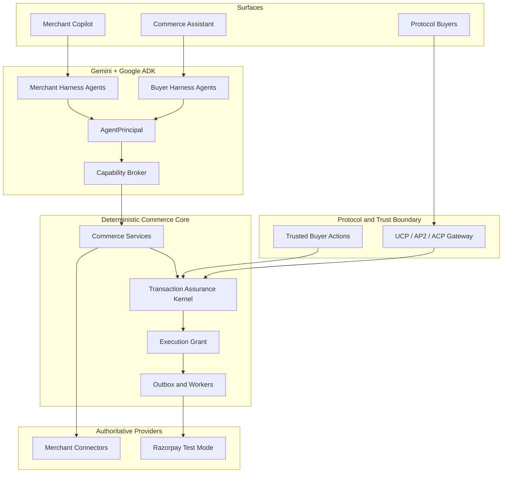
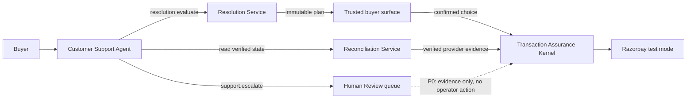
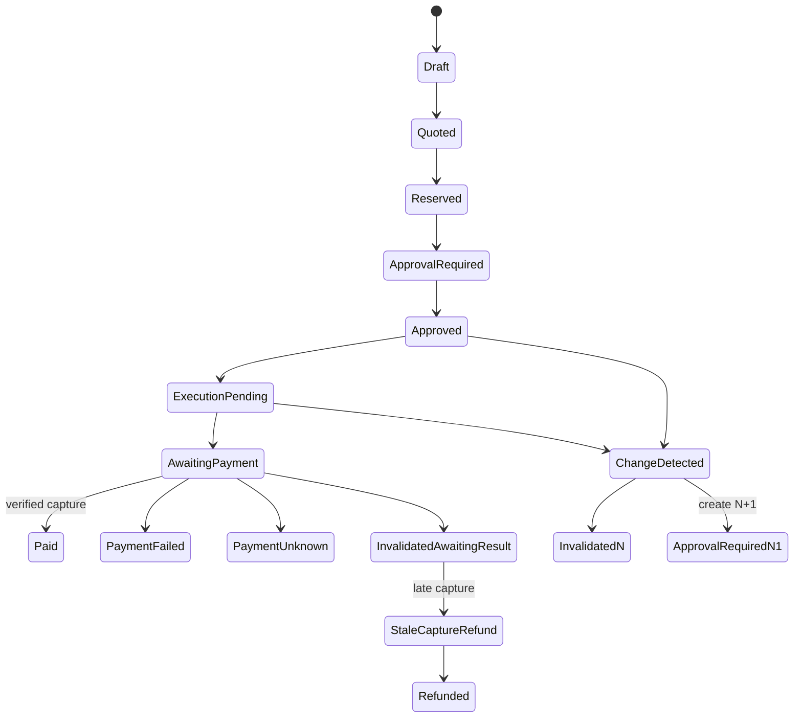
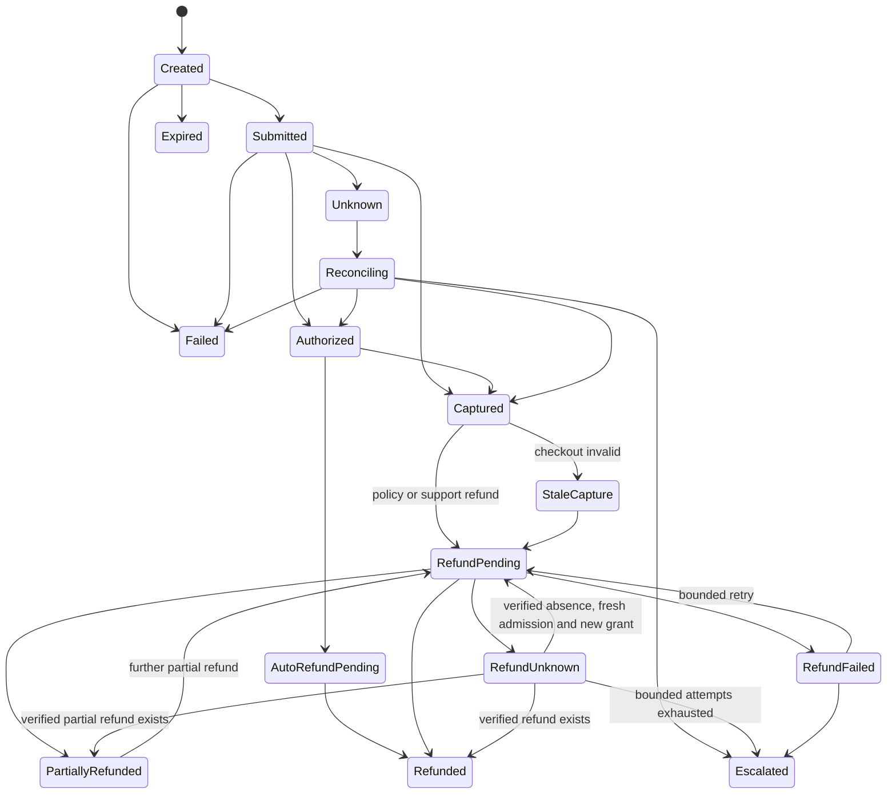
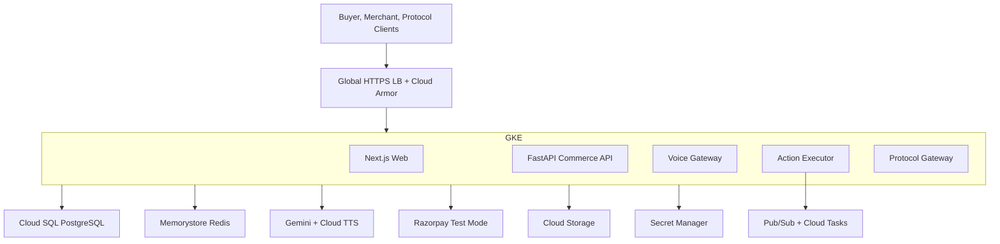

# Governed Agentic Commerce Platform for Razorpay Track 1

## Complete P0 Product, Agent, Money-Flow, Security and System-Design Specification

> Internal execution specification for a Razorpay Buildathon Track 1 project.  
> This is an independent project proposal, not an official Razorpay, Zepto, Google, Anthropic, OpenAI or NPCI product.

---

## 0. Document contract

This document is the authoritative P0 specification for the project discussed in this session. It consolidates the product vision, two-copilot agent architecture, complete quick-commerce reference experience, merchant onboarding, merchant-growth engine, deterministic transaction kernel, Razorpay test-mode integration, realtime multilingual voice, UCP, full human-present AP2, ACP readiness, security, deployment, testing and evidence strategy.

The following rules apply when an AI coding assistant or developer uses this document:

1. Treat P0 as an internal planning label. Do not create folders, comments, UI labels or public product copy named `p0`, `phase-one`, `hackathon`, `competitor`, `zepto-clone` or `future-work`.
2. Use neutral product names in code and UI, such as `buyer-web`, `merchant-console`, `commerce-api` and `transaction-kernel`.
3. Do not claim that planned functionality is implemented. Maintain an evidence-driven status table in the public repository.
4. Do not claim an official integration with Zepto, Zomato, ChatGPT, Gemini/Google AI Mode, Claude or NPCI unless separately approved and actually available.
5. Do not weaken a financial invariant to make a demo easier.
6. Do not add a separate Payment Agent, Voice Agent, Failure Agent, Growth Agent or Revenue Intelligence Agent to P0.
7. Do not add merchant-created, cloned or custom agents to P0. Merchants configure the built-in agents and deterministic policies only.
8. Do not add Claude as a runtime dependency. Gemini is the selected model provider. The pitch may explain that the provider and MCP boundaries permit a later Claude integration.
9. Human review in P0 is a queue with evidence, not a human workflow. Build the Reconciliation Service, the Resolution Service and the Customer Support Agent completely. Build case creation, the read-only queue and evidence export. Do not build operator assignment, decision recording or reviewer execution, and do not stage a human resolving a case in the demonstration.
10. Do not use Google ADK `run_live`, native audio output or ADK tool confirmation on any path that touches money. ADK runs in text mode. The voice gateway owns the speech streams. Approval is recorded on the trusted buyer surface. Capability gates are tool callbacks that return a non-empty structured deny.
11. A component named in this document as deterministic must not be implemented as a prompt. The Reconciliation Service, the Resolution Service, the policy engine, the fee engine and the kernel contain no model call.

---

## 1. Executive summary

The product is a multi-tenant agentic-commerce platform that lets a merchant become discoverable, conversational and safely transactable through AI. A complete Zepto-style quick-commerce storefront is the reference implementation, but the platform is merchant-neutral and adapter-driven rather than hard-coded to one business.

Buyers see one **Commerce Assistant**. Merchants see one **Merchant Copilot**. Six internal agents collaborate inside those two harnesses:

| Visible harness | Internal agents |
| --- | --- |
| Commerce Assistant | Commerce Assistant Coordinator; Discovery & Basket Agent; Checkout & Order Agent; Customer Support Agent |
| Merchant Copilot | Merchant Copilot Coordinator; Merchant Operations Agent |

The agents do not become financial authorities. They understand intent, retrieve grounded commerce data, propose actions, explain decisions and coordinate recovery. A deterministic **Transaction Assurance Kernel** decides whether a money-adjacent or money-moving action is admissible. Razorpay test mode executes the payment. PostgreSQL records the authoritative state and evidence.

The core design sentence is:

> **Agents propose; deterministic systems authorize and execute.**

The buyer can still say, “Pay for this order” by voice. The Commerce Assistant understands the request and prepares it, but the trusted buyer surface records the consent or presents the valid delegated authority to the kernel. The kernel revalidates the merchant state, verifies the exact checkout hash and authority bounds, admits one execution, and only then lets the payment adapter create a Razorpay order.

This strengthens the Track 1 requirement that every money action be:

- **Explainable:** the UI and audit trail show intent, state, policy, approval, decision, provider result and recovery.
- **Bounded:** authority is bound to the current checkout version, exact or configured amount scope, currency, merchant, action, expiry, frequency or cumulative scope where applicable, and revocation epoch.
- **Gated:** no LLM, connector, worker, protocol endpoint or frontend can bypass the kernel.

It also serves merchant growth. The same kernel that blocks stale or unsafe execution enables safe recovery, substitutions, reapproval, payment retry, delivery alternatives, basket nudges, reorders and post-purchase resolution. Growth is measured as captured and retained revenue, not merely orders created.

---

## 2. Track 1 alignment

### 2.1 Track outcome

The project demonstrates both sides of the Track 1 opportunity:

1. **Make a merchant transactable by an AI buyer end to end:** grounded discovery, basket construction, quote, reservation, approval, Razorpay test-mode payment, order, tracking, cancellation and refund.
2. **Grow merchant revenue:** recover checkouts that would otherwise be abandoned, increase useful basket value within merchant policy, improve payment completion, reduce avoidable refunds and expose reliable revenue evidence.

### 2.2 The unique signal for Razorpay

Most conversational-commerce demos stop at recommendation or invoke a payment link after an LLM says the basket is ready. This product focuses on the harder payment boundary:

> An approved payment must remain correct under concurrent requests, merchant-state changes, uncertain provider outcomes, buyer revocation and post-capture failure.

That is directly relevant to a payment platform because it separates persuasive conversational behavior from authoritative financial execution.

### 2.3 What the project proves

- A reusable merchant platform, not a one-off chatbot.
- A complete quick-commerce reference journey.
- One commerce state model that is adaptable through merchant policies and vertical adapters, not forced to behave identically across verticals.
- Buyer and merchant copilots that share commerce capabilities without sharing authority.
- Razorpay test-mode payment execution and verification.
- Freshness, approval binding, concurrency control, idempotency and reconciliation.
- Safe voice-driven commerce without making a voice transcript payment authority.
- UCP with a cryptographically complete human-present AP2 flow.
- ACP-compatible endpoints and a local external-AI-buyer simulator; official ChatGPT onboarding remains external.
- Merchant growth linked to payment-aware evidence.

### 2.4 What the project does not claim

- It is not an official Zepto or Zomato integration.
- It is not automatically listed inside Gemini, Google AI Mode, ChatGPT or Claude.
- ACP compatibility does not equal ChatGPT approval.
- UCP implementation does not equal Google distribution approval.
- The project does not invent an unpublished NPCI UAP schema.
- Razorpay is the payment rail; the project does not claim that Razorpay natively consumes UCP or AP2 artifacts.
- The protocol flow is not a headless Razorpay charge. Payment completes on the trusted buyer surface using Razorpay Standard Checkout.
- Synthetic scenarios show system behavior, not production revenue lift.
- The project does not claim that Razorpay lacks any comparable internal capability.

### 2.5 Track 1 core demonstration

Everything after this section is depth: the kernel, GKE, AP2 cryptography, the security
model. That depth exists to make the eleven steps below true, and it must never obscure
them. If a reader finishes this document unable to describe this sequence, the document
has failed regardless of how complete the rest is.

```text
 1. Multilingual grounded product discovery
 2. Useful basket growth within merchant policy
 3. Checkout construction
 4. Trusted approval
 5. Merchant state changes underneath the approved checkout
 6. The old approval is rejected
 7. Exact delta shown; version N+1 created
 8. Fresh approval on N+1
 9. Razorpay test-mode payment, executed exactly once
10. Money Action Proof Chain verifies end to end
11. Merchant retained-revenue evidence
```

Steps 5 to 8 are the part most conversational-commerce demos skip, and they are the reason
this project is a payments project rather than a shopping chatbot. Steps 9 to 11 are what
make it a Razorpay project rather than an architecture exercise.

This sequence is the definition of done in section 40 and the primary live scenario in
section 31.1. Scope pressure resolves toward it: a capability that no step here depends on
yields to one that a step here needs.

---

## 3. Product principles and non-negotiable invariants

1. LLMs may interpret and propose; only deterministic code may authorize and execute money.
2. Every payment, refund, cancellation with financial effect, delegated-authority consumption and provider reconciliation passes through the kernel.
3. An approval is bound to one immutable checkout version and RFC 8785 canonical hash.
4. Inventory, prices, fees, discounts, fulfilment, policy and authority are revalidated immediately before admission.
5. A material change permanently invalidates version N and creates version N+1 with a new hash and fresh approval.
6. Single-winner execution is guaranteed by database locks, constraints and idempotency records.
7. An unknown external outcome is reconciled before any retry.
8. Webhooks are authenticated against the raw body, stored before processing, deduplicated and applied monotonically.
9. Authorized and captured payments are different states; fulfilment requires verified capture.
10. A capture on an invalidated checkout never starts fulfilment. It enters an idempotent refund path.
11. Reservation validity is checked synchronously using the database clock. Cleanup workers are not correctness authorities.
12. Revocation and admission share one database linearization point through the locked authority row and revocation epoch.
13. Product descriptions, merchant text, protocol payloads and tool output are untrusted data.
14. Tenant identity comes from the authenticated server context, never from an LLM argument or unverified host header.
15. Agent capabilities, trusted buyer-surface actions, trusted operator actions and kernel-internal operations are four physically and logically separate registries. Registry D, trusted operator actions, is defined in section 5.3 and is not implemented in P0.
16. Voice and translation never become payment authority.
17. Approval, total, payment, refund, cancellation and delegated-authority speech uses deterministic templates.
18. PostgreSQL is the source of truth for money, authority, audit and durable work. Redis accelerates but never authorizes.
19. Pub/Sub and Cloud Tasks wake work; the PostgreSQL outbox/work tables preserve recoverability.
20. Revenue reporting separates attempted, admitted, authorized, captured, refunded, retained and preserved revenue.
21. Merchant growth policies cannot impose a universal low-value ceiling on all merchants. Bounds are configurable, contextual and risk-aware.
22. Payment-provider facts come from Razorpay verification, webhooks or reconciliation—not an LLM statement or browser redirect alone.
23. Protocol wire formats stay outside the kernel. The gateway verifies them and emits a typed, verified authority proof.
24. External protocol readiness is not the same as approval, onboarding or distribution on a consumer platform.
25. Every public claim must have a reproducible evidence path.
26. Every agent request is attributable to an immutable AgentPrincipal with tenant, session, capability and delegation scope.
27. Every provider mutation consumes one single-use Execution Grant bound to the admitted operation.
28. Safe Mode can stop new delegated payments without disabling buyer-protective reconciliation, refunds, support or fresh human-present Checkout.
29. Every completed money action has a verifiable Money Action Proof Chain and immutable Policy-at-Sale Receipt.

---

## 4. Product surfaces

### 4.1 Buyer surface: Commerce Assistant

The buyer receives a complete, multilingual, multimodal quick-commerce experience:

- Location and serviceability selection.
- Home feed, categories, filters and merchant offers.
- Grounded text and voice search.
- Product cards and product details.
- Comparison, goal-based baskets, upsell and cross-sell.
- Basket editing, coupons and delivery-slot selection.
- Search availability indicators.
- Checkout revalidation status.
- Temporary-reservation status and countdown.
- Trusted approval card with exact items, fees, discounts, total, expiry and authority scope.
- Delta card after a price, stock, fee, discount or fulfilment change.
- Razorpay Standard Checkout in test mode.
- Order confirmation and live status.
- Order tracking, cancellation, refund, partial-refund explanation and support escalation.
- Revocation of future delegated authority.
- Action timeline showing sources, policies, decisions and outcomes.

### 4.2 Merchant surface: Merchant Copilot

The merchant receives:

- Deterministic onboarding and connector setup.
- Store, catalogue, inventory, fee, fulfilment and policy configuration.
- Built-in agent configuration within allowed properties.
- Catalogue health and discoverability analysis.
- Inventory, price and connector anomaly detection.
- Substitution and delivery policy configuration.
- Discount, promotion and margin guardrails.
- Checkout-recovery and growth recommendations.
- Captured/retained revenue, completion and recovery metrics.
- Failure rate by checkout configuration.
- Operational exceptions and human approval.
- Audit, policy-decision and protocol evidence.

P0 does **not** let a merchant create, clone or publish arbitrary new agents. The merchant uses the built-in agents and changes only typed, allowlisted properties and policies.

### 4.3 Trusted buyer surface

The trusted buyer surface is part of the buyer app but is not an LLM tool. It performs:

- Authentication and ownership checks.
- Approval recording and rejection.
- Exact checkout and delta rendering from server-confirmed data.
- Delegated-authority revocation.
- Cancellation confirmation.
- Refund confirmation.
- Razorpay Checkout launch and payment-result submission.

Transactional UI segments are dynamic and uncached. The approval card submits the checkout ID, version and hash it displayed.

---

## 5. Architecture

### 5.1 Logical architecture



### 5.2 Authority boundaries

| Layer | May do | Must never do |
| --- | --- | --- |
| LLM agents | Understand intent, retrieve grounded state, propose commerce actions, explain deterministic results, coordinate handoffs | Approve, authorize, charge, refund, mutate financial state directly, invent product/price/offer, accept its own tool output as authority |
| AgentPrincipal | Identify the exact agent, tenant, session, delegation chain and granted capability for a request | Acquire a capability not present in its immutable session grant or impersonate another tenant/buyer |
| Capability broker | Resolve an agent's allowed tools from an immutable session configuration and tenant context | Add capabilities from prompt text, product data, tool output or sub-agent request |
| Commerce services | Search catalogue, calculate quote, reserve inventory, evaluate policies, create proposed orders | Bypass admission for a money action |
| Protocol gateway | Parse schema, authenticate caller, verify signatures/mandates, create verified authority proof | Treat an unverified payload as authority or expose raw private material |
| Trusted buyer surface | Record buyer decisions, launch Razorpay Checkout, revoke authority | Decide merchant prices/policies or mark a payment captured |
| Transaction kernel | Lock authoritative rows, validate invariants, consume authority, admit one operation, record evidence | Infer user intent or trust prose |
| Execution grant | Bind one admitted operation to one checkout, amount, actor, command and short expiry | Authorize a different operation, survive consumption or grant generic Razorpay access |
| Payment adapter/worker | Execute admitted provider commands, verify/reconcile outcomes | Execute an unadmitted command or alter the checkout to fit the payment |
| Razorpay | Provide authoritative payment/refund state for its rail | Decide merchant inventory or fulfilment truth |

### 5.3 Four capability registries

#### Registry A: agent-grantable capabilities

- `catalog.search`
- `catalog.get_product`
- `inventory.check`
- `basket.create`
- `basket.update`
- `quote.request`
- `reservation.request`
- `checkout.submit_for_approval`
- `checkout.submit_approved`
- `order.track`
- `order.propose_cancel`
- `refund.propose`
- `support.escalate`
- `merchant.catalogue_health.read`
- `merchant.inventory_anomalies.read`
- `merchant.checkout_metrics.read`
- `merchant.growth_proposal.create`
- `checkout.read`
- `policy.search`
- `resolution.evaluate`
- `support.case.read`

#### Registry B: trusted buyer-surface actions

- `approval.record`
- `approval.reject`
- `authority.revoke`
- `order.confirm_cancel`
- `refund.confirm`

#### Registry D: trusted operator actions (defined, not implemented in P0)

Reserved for a future authenticated merchant or platform operator. **Empty in P0.**

- `review.decision.record`
- `review.case.assign`
- `review.case.resolve`

A reviewer must never act through Registry B. Registry B records what the *buyer*
decided; an operator invoking `refund.confirm` or `approval.record` would be manufacturing
buyer consent that the buyer never gave, and the audit trail would then attribute a
merchant decision to the buyer. Operator authority is a separate registry with its own
surface, its own actor type in the audit record and its own policy gate:

```text
Human Reviewer
    -> Trusted Operator Surface (authenticated, step-up, MFA)
    -> review.decision.record          (Registry D)
    -> Resolution Service / policy engine
    -> Transaction Assurance Kernel    (same admission transaction)
    -> single-use Execution Grant
```

The reviewer's decision is an *input* to the kernel, never a bypass of it. A decision that
implies money movement still passes admission, still revalidates merchant state, and still
consumes exactly one Execution Grant. P0 implements none of this: it ships the queue and
its evidence only, per section 36.

#### Registry C: kernel-internal operations

- `checkout.revalidate`
- `inventory.reserve_commit`
- `inventory.reserve_release`
- `authority.consume`
- `execution_grant.issue`
- `execution_grant.consume`
- `payment.create_order`
- `payment.handoff_create`
- `payment.result_verify`
- `payment.reconcile`
- `refund.execute`
- `refund.reconcile`
- `webhook.apply`
- `order.cancel_execute`
- `resolution.plan_issue`

No agent manifest can name a Registry B, C or D operation. The worker invokes Registry C through the kernel module and a restricted database role; it cannot update payment or refund tables directly.

### 5.4 AgentPrincipal

Every agent capability request carries an immutable machine principal created by the server at session start:

- `principal_id`.
- Agent role and immutable built-in agent/configuration version.
- `tenant_id` and merchant/store scope.
- Pseudonymous buyer/session scope when buyer-facing.
- Permitted Registry-A capabilities.
- Delegation parent and complete delegation chain.
- Session issue/expiry time.
- Correlation ID and authentication assurance.

The model cannot supply or edit this object. The capability broker constructs the effective permission as the intersection of:

1. Built-in agent allowlist.
2. Immutable merchant configuration.
3. Authenticated tenant/session scope.
4. Parent-agent capability subset.
5. Current system operating mode.

Every tool call, policy decision and kernel submission records `principal_id`. A product description, prompt, protocol payload or tool response cannot create another principal or expand its capability set.

### 5.5 Canonical Money Action Proof Chain

Every money-affecting action must be traceable through this complete chain:

> Buyer intent → AgentPrincipal and proposal → authoritative commerce facts → checkout version and JCS hash → Policy-at-Sale Receipt → buyer approval or verified mandate → kernel admission decision → single-use Execution Grant → durable command → Razorpay request → signed callback/webhook or provider reconciliation → final PostgreSQL state.

Evidence is tiered, so that a denied action is still fully explainable even though it has no provider capture:

| Action reached | Evidence guaranteed |
| --- | --- |
| Attempted | Audit trace with actor, principal, inputs and the deterministic decision |
| Admitted | Admission decision plus Execution Grant trace |
| Externally executed | Provider request reference and verified provider evidence |
| Completed | The complete end-to-end Money Action Proof Chain |

The Protocol Inspector presents a redacted view of every link. A missing, mismatched or unverifiable link means the platform cannot call the action complete.

---

## 6. Agent architecture: two copilots, six internal agents

Failure handling is embedded in the responsible agent and deterministic lifecycle. There is no separate Failure Agent.

### 6.1 Commerce Assistant Coordinator

**Purpose**

- Own the buyer conversation across text and voice.
- Detect intent and route work to discovery, checkout or support.
- Preserve session, tenant, locale, modality and correlation IDs.
- Summarize agent results without changing their authoritative fields.
- Coordinate modality fallback when voice fails.

**Allowed capabilities**

- Read the session-scoped basket, checkout and order summary.
- Delegate to the three buyer agents using typed messages.
- Ask clarifying questions.
- Switch between voice and text.
- Request deterministic trusted-speech messages.

**Policies**

- A sub-agent receives no capability that the coordinator does not possess.
- Route by structured intent; do not expose internal agent names to the buyer unless useful.
- Use the same commerce session for voice and chat.
- Never present an interim STT transcript as confirmed intent.
- Never summarize away a material price, fee, item, quantity, delivery or refund difference.
- Never claim payment success from conversation state.

**Failures handled conversationally**

- STT disconnect.
- TTS failure.
- Interruption and barge-in.
- Echo and false transcript.
- Model timeout.
- Modality fallback.

**Fallback**

- Keep the transaction unchanged.
- Preserve the deterministic state card.
- Switch to text and allow manual continuation.

### 6.2 Discovery & Basket Agent

**Purpose**

- Search, compare and recommend grounded catalogue items.
- Build and edit baskets.
- Provide policy-bounded upsell and cross-sell.
- Support goal baskets, reorders and explicitly stored preferences.

**Allowed capabilities**

- `catalog.search`
- `catalog.get_product`
- `inventory.check`
- `basket.create`
- `basket.update`
- `quote.request`
- `reservation.request`

**Policies**

- Every proposed item must resolve to an active merchant catalogue ID in the same tenant/store.
- Search results include source, freshness and serviceability.
- Product description is untrusted data and cannot create instructions or tools.
- The deterministic fee engine computes threshold gaps; the agent only phrases the nudge.
- Cross-sell must satisfy merchant margin, category, inventory, budget and discount rules.
- Preferences require explicit consent, purpose and TTL.
- Reorders are always revalidated for stock and price and require a fresh approval.
- Do not pressure, fabricate scarcity or hide fees.

**Structured outputs**

- Product IDs with source and freshness.
- Basket mutation proposal.
- Recommendation reason.
- Quote request.
- Recovery code when unavailable.

**Failures handled conversationally**

- No matching products.
- Stale catalogue.
- Unavailable item.
- Unsafe product description.
- Rejected recommendation.
- Catalogue-tool failure.

### 6.3 Checkout & Order Agent

**Purpose**

- Orchestrate the verified checkout lifecycle and recovery paths.
- Request a quote, reservation and approval.
- Submit the approved checkout to the kernel.
- Explain revalidation, price/stock changes, payment state and order state.
- Propose cancellation or refund without executing it.

**Allowed capabilities**

- `quote.request`
- `reservation.request`
- `checkout.submit_for_approval`
- `checkout.submit_approved`
- `order.track`
- `order.propose_cancel`
- `refund.propose`
- `support.escalate`

**Policies**

- The agent never calls Razorpay directly.
- “Submit approved checkout” is the agent's final money-adjacent operation. The kernel decides admission.
- The agent cannot record approval, revoke authority, execute payment/refund or apply a webhook.
- Every material delta creates version N+1; never revive version N.
- Retry only when the kernel returns a retryable structured code.
- Payment unknown means reconcile, not retry.
- Payment pending/authorized is not captured and not fulfilled.
- Cancellation and refund require merchant-policy evaluation and trusted buyer confirmation when needed.

**Failures handled conversationally**

- Duplicate or concurrent request.
- Stale checkout.
- Price or fee change.
- Reservation expiry.
- Revoked or insufficient authority.
- Payment failure.
- Payment pending.

### 6.4 Customer Support Agent

Post-purchase resolution is the part of agentic commerce most likely to invent an answer, because the buyer is upset, the provider state is often uncertain and the amounts are real. P0 therefore splits it into one conversational agent and three deterministic components. The agent explains; it never decides an amount, never resolves a case and never executes.



#### 6.4.1 Reconciliation Service

Deterministic. Kernel-internal operations `payment.reconcile` and `refund.reconcile`. Runs in the Action Executor.

**Owns** every uncertain provider state: `UNKNOWN`, `RECONCILING`, `REFUND_UNKNOWN`, and any case where local state and provider evidence disagree.

**Behavior**

- Reads work from `work_items` with `FOR UPDATE SKIP LOCKED` and a lease.
- Queries Razorpay by authoritative identifiers only: order ID, payment ID, refund ID and the stable merchant-scoped receipt.
- Applies transitions monotonically and only from verified provider evidence. A capture is never regressed to authorized. Unknown is never converted to failed because a UI or a request timed out.
- Writes one `reconciliation_runs` row per attempt: attempt number, identifiers queried, raw evidence reference, decision, resulting transition, next scheduled attempt and correlation ID.
- Bounded attempts with exponential backoff and jitter. On exhaustion, or on contradictory provider evidence at any attempt, it moves the attempt to `ESCALATED` and opens exactly one human-review case.
- While a state is unresolved it blocks a second payment attempt, a new refund and reservation release for that checkout. This is the same block described in sections 10.6 and 10.7, owned here.
- A grant timeout after consumption is reconciled under the same operation. It never issues a replacement Execution Grant.

**Exposes** a read-only projection to the Support Agent and the Merchant Copilot: current verified state, evidence source, last run time, attempts used, attempts remaining and next scheduled attempt. The agent may read this projection; it cannot trigger provider calls directly beyond requesting that reconciliation be scheduled.

#### 6.4.2 Resolution Service

Deterministic. Read-only to agents through `resolution.evaluate`; plans are issued through the kernel-internal `resolution.plan_issue`.

**Input**

- Order, order items and fulfilment evidence from the merchant connector.
- Verified payment and refund state from the Reconciliation Service projection.
- The order's immutable **Policy-at-Sale Receipt** from section 10.2.1, not the merchant's current policy. A merchant who tightened their refund rule yesterday cannot retroactively narrow a sale made last week.
- The buyer's request: cancel, refund, partial refund, substitution or store credit.

**Output** an immutable `resolution_plans` row containing eligible outcomes, the exact integer minor-unit amount for each, the policy IDs and versions cited for each, the required confirmation level, a recovery code and a short TTL.

**Invariants**

- Total refundable never exceeds captured minus cumulative refunds already issued or pending.
- Cash refund is always among the options whenever store credit is offered; store credit requires explicit buyer choice and respects the merchant's policy cap.
- Cancellation respects the Policy-at-Sale cut-off and the current verified fulfilment state.
- A plan is immutable once issued and expires at its TTL; an expired plan is re-evaluated rather than reused.
- If verified payment or refund state is unknown, the service returns `PAYMENT_UNKNOWN` or `REFUND_REVIEW_REQUIRED` and issues no plan.
- If no option satisfies policy, it returns `POLICY_EXCEPTION` or `HUMAN_REVIEW_REQUIRED` and issues no plan.

**Execution** is never the service's own. After the trusted buyer surface records `refund.confirm` or `order.confirm_cancel` against a specific plan ID, the kernel runs its admission transaction and executes `refund.execute` or `order.cancel_execute` under a single-use Execution Grant, with the plan ID inside the idempotency scope. Merchant policy may mark a narrow band of outcomes auto-approved below a configured threshold; those still pass admission and still produce a grant.

#### 6.4.3 Human Review

**P0 scope is the queue and its evidence. The operator action interface is a later increment.**

- `support.escalate`, the Resolution Service and the Reconciliation Service each create `support_cases` rows. States are `OPEN`, `AWAITING_HUMAN`, `RESOLVED` and `CLOSED`.
- **Exactly-once creation.** Three independent components can detect the same problem, so
  unconditional creation would open three cases for one stuck payment and a reviewer would
  work the same evidence three times. Every case carries a deterministic key:

  ```text
  case_key = tenant_id + order_id + payment_or_refund_id + reason_family
  ```

  enforced by a partial unique index, the same mechanism that makes single-winner payment
  admission a database guarantee rather than a hopeful code path:

  ```sql
  UNIQUE (case_key) WHERE state IN ('OPEN', 'AWAITING_HUMAN')
  ```

  All three callers use `open_or_get_support_case(case_key, ...)`, which returns the
  existing active case rather than creating a second. `reason_family` is a coarse
  classification, not a message, so that three phrasings of one stuck refund collapse to
  one case. A concurrency test asserts that simultaneous escalation from the Reconciliation
  Service and the Support Agent yields exactly one row.
- A case carries the blocking reason code, a redacted action timeline, the Money Action Proof Chain reference from section 5.5, correlation IDs, the options the Resolution Service could and could not offer, the verified provider state at the time of escalation and a target response time.
- P0 ships case creation, a read-only queue in the Merchant Copilot showing each case with its evidence, and redacted evidence export.
- Outside P0, listed in section 36: assignment, decision recording, operator notes and execution by a human reviewer.
- **A case never changes financial state by itself.** A future reviewer will act through the Registry D trusted operator path defined in section 5.3, never through Registry B: Registry B records buyer decisions, and an operator using it would manufacture consent the buyer never gave. Operator decisions still pass the same admission transaction, still consume one Execution Grant and are recorded under their own actor type. Human review is an input to the kernel, never a bypass.
**`HumanReviewCase`** — the record created on escalation. Fields marked *(deferred)* are written by the later operator increment and are null in P0.

```text
review_id                 support_case_id           tenant_id
case_key                  reason_family             state
reason_code               requested_outcome         agent_recommendation
evidence_bundle_ref       policy_receipt_id         policy_receipt_hash
disputed_fields           monetary_exposure_minor   currency
proof_chain_ref           priority                  sla_deadline
created_at                created_by_principal
assigned_reviewer  (deferred)   decision       (deferred)
reviewer_reason    (deferred)   approved_action(deferred)   resolved_at (deferred)
```

`monetary_exposure_minor` is copied from verified state, never computed by the agent. `sla_deadline` is a target response time recorded for prioritisation; P0 makes no promise that anyone meets it, and the Support Agent does not quote it to the buyer as a guarantee.

- In the demonstration a case is created and shown in the queue. No human resolves it. The Support Agent gives the buyer the case reference, states what has been verified so far and what happens next, and does not predict the outcome or promise a timeline beyond the recorded target response time.

#### 6.4.4 Customer Support Agent

**Purpose**

- Resolve post-purchase questions through grounded order, payment, fulfilment and refund state.
- Track orders and explain verified status.
- Present the Resolution Service's options for cancellation, refund, partial refund and store credit.
- Explain refund status as provider state changes.
- Guide the buyer to revoke delegated authority on the trusted surface.
- Escalate into the human-review queue with redacted evidence.

**Flow**

1. Read the verified order, payment, fulfilment and refund projections.
2. If any relevant state is unresolved, read the Reconciliation Service projection, tell the buyer what is being verified and why no retry or refund can happen yet, and stop.
3. Otherwise call `resolution.evaluate` with the buyer's request.
4. Present the plan's options using the plan's own amounts and policy citations, never recomputed or rounded by the agent.
5. Hand off to the trusted buyer surface for confirmation where the plan requires it.
6. Explain the kernel decision and then the provider state as it settles.
7. On `POLICY_EXCEPTION` or `HUMAN_REVIEW_REQUIRED`, confirm that one case was created and give the buyer its reference.

**Allowed capabilities**

- `order.track`
- `checkout.read`
- `policy.search`
- `resolution.evaluate`
- `support.escalate`
- `support.case.read`
- Read verified payment, refund and reconciliation projections with sensitive data minimized.

The agent holds **no** `refund.propose` or `order.propose_cancel` capability. Those exist
in Registry A for the Checkout & Order Agent's pre-purchase flow; giving them to Support
as well would create a second path on which a remedy could be shaped outside the
Resolution Service. The buyer's requested outcome instead travels as an *input* to
`resolution.evaluate`, which returns the eligible remedies and their exact amounts.

> The Support Agent never constructs a refund. It asks the deterministic Resolution
> Service which remedies are valid, and presents what comes back.

**Policies**

- Razorpay is authoritative for payment and refund state; the merchant connector is authoritative for fulfilment state; the Resolution Service is authoritative for what is owed; the Policy-at-Sale Receipt is authoritative for which rules apply.
- Never state an amount that did not come from a resolution plan or a verified provider record. The agent performs no arithmetic on money.
- Never promise a refund before kernel admission and provider confirmation.
- Cash refund remains available whenever store credit is offered.
- Never ask the buyer to reveal card details, UPI PIN, OTP, an API key or an AP2 private key.
- Revocation happens on the trusted buyer surface, not through the agent.
- Unknown payment or refund state pauses new execution and defers to reconciliation.
- Human escalation receives a redacted timeline and correlation ID. The agent does not describe what a reviewer will decide.

**Failures handled conversationally**

- Payment unknown, and reconciliation in progress.
- Stale capture on an invalidated checkout.
- Missing items after capture.
- Cancellation outside the policy window.
- Refund unknown.
- Partial refund arithmetic questions, answered from the plan.
- Policy exception.
- Human escalation.

### 6.5 Merchant Copilot Coordinator

**Purpose**

- Provide one coherent merchant-facing assistant.
- Route onboarding/configuration questions to deterministic services.
- Route catalogue, inventory, policy, operations and growth analysis to Merchant Operations.
- Present proposals and evidence without self-applying sensitive changes.

**Allowed capabilities**

- Read merchant onboarding status.
- Read configuration and policy summaries.
- Delegate to Merchant Operations with typed, tenant-scoped messages.
- Present metric projections and controlled-scenario results.
- Submit non-financial configuration proposals for human review.

**Policies**

- Merchant instructions remain lower-precedence data and cannot change system invariants.
- Tenant comes from the merchant's authenticated server session.
- Sensitive policy mutations use ETag/If-Match and merchant-admin authorization.
- Money approval is never a merchant-configurable Boolean that can be disabled globally.
- Growth proposals show expected lever, metric, policy gate, evidence source and reversibility.
- Synthetic analysis is visibly labelled.

**Failures handled conversationally**

- Incomplete merchant configuration.
- Unavailable analytics.
- Connector failure.
- Failed proposal execution.

### 6.6 Merchant Operations Agent

**Purpose**

- Analyse catalogue quality, inventory, pricing, fees, fulfilment and policy conflicts.
- Operate the P0 Merchant Growth Engine as proposals over deterministic data.
- Explain revenue and recovery metrics.
- Identify configurations that increase abandonment or avoidable refund risk.

**Allowed capabilities**

- `merchant.catalogue_health.read`
- `merchant.inventory_anomalies.read`
- `merchant.checkout_metrics.read`
- `merchant.growth_proposal.create`
- Read typed merchant policies and controlled-scenario results.

**Policies**

- Read-only by default.
- An agent proposal cannot directly change price, stock, discount, fee, campaign budget, refund rule or financial authority.
- Recommendations cite source window, sample size and whether data is synthetic.
- Discount recommendations must include gross revenue, discount cost and net captured/retained revenue.
- Do not infer cross-merchant benchmarks from unavailable data.
- Do not reveal one tenant's data to another.
- High-risk configuration changes require merchant-admin review and ETag/If-Match.

**Failures handled conversationally**

- Catalogue-ingestion failure.
- Inventory or pricing anomaly.
- Conflicting merchant policies.
- Operational escalation.

### 6.7 Shared recovery contract

All agents receive typed service responses. They may explain the code but may not override it.

| Recovery code | Meaning | Agent behavior |
| --- | --- | --- |
| `OK` | Request accepted | Continue from returned authoritative state |
| `DUPLICATE_OPERATION` | Existing idempotent result found | Return the original result |
| `CONCURRENT_OPERATION` | Another single-winner action is active | Wait/read current state; do not create another |
| `STALE_CHECKOUT` | Submitted version is no longer current | Show current version and delta |
| `REAPPROVAL_REQUIRED` | Material change needs fresh consent | Render version N+1 trusted approval card |
| `AUTHORITY_REVOKED` | Authority epoch is stale | Stop execution and explain |
| `AUTHORITY_INSUFFICIENT` | Scope does not cover action | Request an appropriately scoped approval |
| `RESERVATION_EXPIRED` | Inventory/quote hold ended | Re-reserve and re-quote |
| `PAYMENT_FAILED` | Provider confirmed failure | Offer policy-safe retry while reservation remains valid |
| `PAYMENT_PENDING` | Non-terminal provider state | Show pending; do not fulfil |
| `PAYMENT_UNKNOWN` | Outcome uncertain | Reconcile; forbid blind retry |
| `STALE_CAPTURE` | Capture belongs to invalidated checkout | Block fulfilment and start idempotent refund |
| `REFUND_ALLOWED` | Refund is admissible | Ask for trusted confirmation where required |
| `REFUND_REVIEW_REQUIRED` | Policy or evidence requires review | Escalate with evidence |
| `POLICY_EXCEPTION` | Standard policy cannot resolve | Explain rule and escalate |
| `HUMAN_REVIEW_REQUIRED` | Automated path intentionally stops | Confirm one support case was created with redacted evidence; give the buyer its reference; state verified facts only. No human action is demonstrated in P0 |
| `RESOLUTION_PLAN_ISSUED` | Resolution Service produced immutable options | Present the plan's own amounts and policy citations; ask the buyer to choose |
| `RESOLUTION_PLAN_EXPIRED` | Plan TTL elapsed before confirmation | Re-evaluate; never reuse an expired plan |
| `RECONCILIATION_IN_PROGRESS` | Provider state is being verified | Explain what is being checked and that no retry or refund can happen yet |

---

## 7. Merchant onboarding and adaptability

Merchant onboarding belongs in P0 because the product claim is a scalable platform, not a single Zepto-style screen. It is a deterministic workflow, not a Merchant Enablement Agent.

### 7.1 Onboarding steps

1. Create tenant and merchant identity.
2. Verify merchant-admin identity.
3. Configure business name, public profile, domain and supported locales.
4. Configure stores, service areas and locations.
5. Select catalogue connector:
   - Platform-managed catalogue.
   - Merchant REST/OpenAPI connector.
   - Merchant webhook/feed connector.
6. Map product, option, inventory and price fields into the canonical domain.
7. Configure currency, tax and integer-minor-unit rounding rules.
8. Configure fulfilment, delivery zones, slots, fees and minimum orders.
9. Configure inventory reservation TTL and substitution policy.
10. Configure discounts, coupons, margin floors and threshold offers.
11. Configure cancellation, refund, partial-refund and store-credit policies.
12. Configure approval, delegated-authority and Reserve Pay policies where enabled.
13. Configure Hindi, Hinglish and English experience.
14. Enable the built-in buyer and merchant agents.
15. Run connector, catalogue, policy, quote and sandbox-checkout tests.
16. Publish an immutable merchant-configuration version.

### 7.2 P0 merchant configurability

Merchants can:

- Use the six built-in agents.
- Enable or disable non-money features.
- Change allowlisted presentation, discovery and recommendation settings.
- Configure deterministic policies and connector mappings.
- Test configuration in a sandbox.
- Publish immutable merchant-configuration versions.
- Roll back configuration after audited review.

Merchants cannot:

- Create, clone or publish arbitrary agents.
- Add arbitrary tools to a built-in agent.
- Disable the kernel or trusted approval requirement.
- Grant payment/refund operations to an LLM.
- Change system prompts with untrusted free-form content.
- Introduce a new protocol or payment adapter through prompt text.

### 7.3 Adaptability model

The platform shares stable primitives:

- Product.
- Basket.
- Quote.
- Reservation.
- Checkout version.
- Approval and delegated authority.
- Order.
- Payment attempt.
- Refund.
- Policy decision.
- Protocol proof.
- Audit event.

Merchant and vertical behavior is injected through typed adapters and policies:

- Catalogue adapter.
- Inventory adapter.
- Pricing/fee adapter.
- Fulfilment adapter.
- Order adapter.
- Payment adapter.
- Cancellation/refund policy.
- Substitution policy.
- Offer and margin policy.
- Localization pack.

The quick-commerce reference demonstrates volatility and rapid recovery. A future restaurant merchant can reuse the kernel and agents while replacing grocery substitutions with menu modifiers and preparation constraints. The system is adaptable; it does not force every vertical into identical behavior.

---

## 8. Complete P0 quick-commerce reference experience

Use a neutral “Demo Grocery Store” with synthetic products and explicitly state that it demonstrates a Zepto-class journey.

### 8.1 Storefront

- Address/location selection and serviceability.
- Store selection based on service area.
- Home feed and categories.
- Search with autocomplete and filters.
- Product detail, variants and quantity.
- Live inventory and price freshness indicator.
- Offers/coupons sourced from deterministic policy objects.
- Cart and delivery-slot selection.
- Delivery fee and threshold calculation.
- Text and realtime voice conversation.
- Recommendations and substitutions.
- Goal basket and reorder.

### 8.2 Transaction journey

The UI visibly renders:

> Search availability → Checkout revalidation → Temporary reservation → Trusted approval → Payment → Verified order

Required UI states:

- Searching.
- Availability checked.
- Quote calculated.
- Inventory temporarily reserved.
- Approval required.
- Approved with version/hash evidence.
- Revalidating.
- Material delta and reapproval required.
- Payment opening.
- Authorized.
- Captured.
- Payment pending/unknown.
- Reconciliation.
- Order confirmed.
- Cancellation/refund.
- Stale capture and automatic refund.

### 8.3 Post-purchase capabilities

- Track order.
- Cancel within merchant policy.
- Request a refund.
- Handle a partial refund for unavailable items.
- Explain refund status.
- Revoke future delegated authority.
- Escalate disputes to a human.

---

## 9. Merchant Growth Engine inside Merchant Copilot

Growth is a capability of the existing Merchant Copilot and Merchant Operations Agent. It is not a separate autonomous Growth Agent.

### 9.1 Growth features in P0

| Feature | Revenue lever | Measurement | Deterministic gate |
| --- | --- | --- | --- |
| Reapproval with substitution | Recover changed checkouts instead of abandonment | Conversion after reapproval; preserved revenue | Current inventory, substitution policy, new version/hash and fresh approval |
| Threshold nudge | Increase useful basket value | Threshold-cross rate and AOV | Fee engine computes exact gap; agent only phrases |
| Failed-payment retry inside reservation | Improve completion | Completion after first failure | Same valid version/amount, reservation valid, previous outcome definitively failed |
| Abandoned checkout to Payment Link | Recover admitted checkout | Recovered checkout count/value | Admitted immutable version, consent to contact, link expiry no later than reservation/quote |
| Cash refund or store-credit choice | Retain revenue without trapping buyer | Refund-to-credit and retained revenue | Cash always offered, explicit choice, policy cap |
| Top-seller out-of-stock alert | Prevent lost sales | Failures attributable to stock | Authoritative inventory and human-applied operational proposal |
| Reservation countdown | Improve completion in valid window | Completion within reservation | Database expiry; deterministic visible/spoken template |
| Cheaper slot/fee alternative | Reduce fee abandonment | Conversion by selected slot/fee | Fulfilment and fee engine returns valid choices |
| Policy-bounded cross-sell | Increase attach rate | Attach rate, AOV, net margin | Inventory, relevance, buyer budget, margin floor and discount ceiling |
| Goal basket | Increase useful item count | Items/order and budget utilization | Grounded products and deterministic total |
| One-tap reorder | Improve frequency | Repeat-purchase rate | Revalidate every item/price and obtain fresh approval |
| Explicit preferences with TTL | Improve relevance | Conversion by approved preference use | Consent, purpose, expiry and buyer deletion |
| Merchant offers as policy objects | Improve conversion | Conversion and discount cost | Deterministic eligibility and application |
| Hindi/Hinglish journey | Expand accessible demand | Conversion/completion by language | Same kernel; deterministic money language |
| External AI-buyer channel | Expand distribution | Captured revenue by channel | Protocol verification, kernel admission and external onboarding |
| Catalogue discoverability health | Prevent hidden demand loss | Search misses due to missing attributes | Grounded catalogue diagnostics |
| Checkout-configuration analysis | Reduce funnel failure | Failure rate by fee/slot/policy configuration | Controlled scenarios and human-reviewed proposals |

### 9.2 Growth-safe policy rule

Financial safety must not be implemented as a universal product-killing cap such as “₹500 maximum per order,” “four debits per day,” or “valid until 10 September.”

Instead, bounds are composed from:

- Current checkout amount and currency.
- Checkout version and canonical hash.
- Merchant and store.
- Action type.
- Quote/reservation/mandate expiry.
- Buyer-selected or delegated cumulative amount.
- Frequency only where the buyer or applicable mandate deliberately specifies it.
- Product/category/payment-rail scope.
- Discount and substitution tolerance.
- Merchant risk tier and payment configuration.
- Current revocation epoch.

A high-value merchant can support high-value purchases when the buyer, merchant policy and payment rail permit them. “Bounded” means precisely scoped, not universally small.

### 9.3 Revenue metrics

- Payment-completion rate.
- Failure rate by checkout configuration.
- Conversion after price/stock reapproval.
- Refund and cancellation rate.
- Discount cost.
- Order value and average order value.
- Repeat-purchase rate.
- Attempted revenue.
- Admitted revenue.
- Authorized revenue.
- Captured revenue.
- Refunded revenue.
- Net retained revenue after refunds and discount cost.
- Revenue preserved through recovery.
- Recovered abandoned checkouts.
- Duplicate charges prevented.
- Double refunds prevented.
- Support/refund operations avoided.

Every number from synthetic traffic is labelled **controlled scenario**. At least one real Razorpay test-mode payment proves execution. No synthetic result is presented as actual production lift.

---

## 10. Transaction Assurance Kernel

### 10.1 Versioned checkout

Every checkout version contains:

- Tenant, merchant and store.
- Pseudonymous buyer/session reference.
- Line-item IDs, options, quantities and unit prices.
- Discounts.
- Taxes and fees.
- Fulfilment selection.
- Currency and integer-minor-unit total.
- Inventory and price source timestamps.
- Merchant-policy version.
- Version number.
- RFC 8785 JCS canonical content hash using SHA-256.

The merchant's configured rounding policy is applied deterministically at line, tax, discount and total boundaries. The final quote total must equal the Razorpay order amount exactly.

Once an approval is requested, a checkout version is immutable.

### 10.2 Approval and authority binding

An approval record binds:

- Buyer or delegated authority.
- Tenant, merchant and store.
- Checkout ID, version and JCS hash.
- Amount and currency.
- Permitted action.
- Applicable cumulative/frequency/category constraints.
- Issued and expiry timestamps.
- Authority epoch.
- Revocation state.

Any material item, quantity, substitution, price, discount, tax, fee, fulfilment or total difference invalidates the approval.

The authority row has a monotonically increasing `revocation_epoch`. Revocation increments it under a database lock. Admission locks the same row. If revocation commits first, admission fails. If admission commits first, that already-admitted action is recorded as consumed and revocation blocks subsequent actions.

### 10.2.1 Policy-at-Sale Receipt

When a checkout first enters `APPROVAL_REQUIRED`, create an immutable Policy-at-Sale Receipt containing:

- Tenant, merchant, store, checkout ID/version and JCS hash.
- Every applicable merchant-policy ID and immutable version.
- Cancellation, refund, substitution, delivery, discount and fulfilment terms.
- `applies_to` line-item/order targets.
- Buyer-visible policy links/text references.
- Tax and rounding policy version.
- Creation timestamp, receipt hash and audit correlation ID.

The binding is mechanical, not narrative. `policy_receipt_id` and `policy_receipt_hash` are stored on the checkout version, on the approval and on the resulting order, and `policy_receipt_hash` is included in the exact approval and proof material that is signed or hashed. Checkout version 7 bound to policy receipt v12 therefore cannot later be recombined with policy receipt v13 without breaking a verified binding.

The exact receipt is bound into the approval and copied to the resulting order. A later merchant-policy change cannot silently rewrite the rules governing an existing sale. If current law, network/provider rules or an explicit buyer-favourable exception supersedes an old merchant rule, the system records the override and its authority without modifying the historical receipt.

### 10.3 Admission transaction

1. Receive a trusted-surface approval or `VerifiedAuthorityProof`.
2. Begin one database transaction.
3. Lock the system/tenant operating-mode row, checkout version, reservation, authority and single-winner execution rows.
4. Verify the `AgentPrincipal` or protocol/trusted-surface actor is permitted to submit this operation.
5. Apply Safe Mode restrictions before accepting delegated execution.
6. Verify version and Policy-at-Sale Receipt are current, immutable and mutually bound.
7. Check reservation validity with the database clock.
8. Re-read stock, price, fees, discount, fulfilment and merchant policy.
9. Recalculate the exact integer-minor-unit total.
10. Match hash, amount, currency, action, expiry and authority epoch.
11. If material state changed:
   - Deny admission.
   - Permanently invalidate version N.
   - Create version N+1 with a new JCS hash.
   - Return a structured delta and `REAPPROVAL_REQUIRED`.
   - Create no Razorpay order.
12. If unchanged:
   - Atomically consume a single-use approval or allocate the permitted debit against a reusable bounded mandate.
   - Create the one winning payment attempt.
   - Issue a single-use Execution Grant for the exact committed provider operation.
   - Store the payment-handoff command in the outbox.
   - Commit.
13. The worker executes only the command named by a valid, unconsumed Execution Grant.

### 10.3.1 Single-use Execution Grant

The kernel issues an opaque grant only after successful admission. It binds:

- Grant ID and cryptographically random nonce/hash.
- Tenant, merchant and store.
- Checkout ID, immutable version and JCS hash.
- Payment attempt or refund ID.
- Exact operation, amount and currency.
- Razorpay adapter/account reference.
- Outbox command ID.
- Kernel decision ID and approving authority reference.
- `issued_at`, short `expires_at` and status.

States are `ISSUED`, `CONSUMED`, `EXPIRED` and `REVOKED`. The restricted worker locks and consumes the grant before the first provider attempt and verifies every command field byte-for-byte. A timeout after consumption becomes `UNKNOWN` and is reconciled under the same operation; it never creates a replacement grant or a second charge blindly.

The grant is not returned to the LLM or browser and is not a generic bearer token for Razorpay. An agent compromise after admission cannot change the amount, merchant, checkout or operation. This control does not pretend to protect against a fully compromised payment worker holding provider credentials; that threat is addressed by workload isolation, least-privilege secrets, egress policy, monitoring and key rotation.

### 10.3.2 Delegated-payment Safe Mode

Persist an auditable operating mode in PostgreSQL:

- `NORMAL`: enabled payment paths operate under their normal gates.
- `SAFE_MODE`: block new Reserve Pay/delegated-authority debits and external autonomous completion, while keeping fresh human-present Razorpay Standard Checkout, reconciliation, refunds, tracking, support and read operations available.

Safe Mode can be activated globally or for a tenant/payment account by an authorized operator, or automatically by an allowlisted deterministic incident rule such as key-compromise evidence, abnormal duplicate attempts, excessive unresolved reconciliation, signature-verification anomalies or a declared provider incident.

Activation:

- Invalidates unused delegated Execution Grants.
- Prevents new delegated grants at admission.
- Does not erase existing evidence.
- Does not convert unknown outcomes to failed.
- Allows reconciliation and buyer-protective refunds to finish.
- Produces a visible banner, reason code, actor and audit event.

Return to `NORMAL` requires an authenticated, audited administrative action after the incident condition is resolved. The LLM cannot enter or leave Safe Mode.

### 10.4 Checkout state machine



Version N never returns to `APPROVED`. Version N+1 has a new hash, approval and protocol artifacts.

Cancellation and reservation expiry are explicit transitions from every eligible non-terminal state. A reservation is released on failure, cancellation and expiry, but held while a payment outcome is unknown until reconciliation resolves it or policy escalates it.

### 10.5 Payment state machine



`Escalated` freezes the attempt and opens exactly one human-review case, keyed as in section 6.4.3 so that concurrent detectors cannot open several. Only a future reviewer acting through the Registry D operator path can move it. Policy and support refunds after a valid capture, repeated partial refunds and bounded refund retry are explicit transitions, not prose-only behavior.

### 10.6 Idempotency and concurrency

- Stable merchant-scoped idempotency key per business operation.
- One Razorpay order per immutable checkout version.
- Partial unique index allowing only one non-terminal payment attempt per checkout.
- One single-winner admission transition under row locks.
- Duplicate valid request returns the original result.
- New attempt after failure/expiry first reconciles the existing provider order/payments.
- Create-order timeout triggers lookup by stable receipt before any new create.
- Refund timeout enters `REFUND_UNKNOWN` and fetches existing refunds before retry.
- The two refund failure states are not interchangeable, and conflating them is how a
  buyer gets refunded twice:

  | State | Meaning | Permitted next step |
  | --- | --- | --- |
  | `REFUND_UNKNOWN` | The provider outcome is genuinely unknown; a refund may already exist | Reconcile only. **Never issue another Execution Grant blindly.** Fetch the payment's refunds by authoritative identifier first; only a verified absence permits a new attempt |
  | `REFUND_FAILED` | The provider definitively confirmed failure; no refund exists | Retry where merchant policy allows, through a **fresh kernel admission** producing a **new single-use Execution Grant** for the same logical refund operation |

  Both paths preserve the global invariant: every provider mutation consumes exactly one
  Execution Grant, and a retry is a new grant rather than a reused one.
- Cancellation/payment/refund races use locked state transitions.
- Browser payment-verification submissions are idempotent.

### 10.7 Unknown outcomes

When a provider request times out or loses its response:

1. Mark the attempt `UNKNOWN`.
2. Block a second attempt for the same checkout/authority.
3. Enqueue durable reconciliation.
4. Fetch Razorpay by authoritative identifiers.
5. Move to captured, authorized or failed only from verified evidence.
6. Escalate after a bounded number of reconciliation attempts.

Never turn “unknown” into “failed” because the UI timed out.

### 10.8 Open-checkout invalidation and stale capture

A merchant-state change can occur while Razorpay Checkout is open:

- Mark the bound checkout `INVALIDATED_AWAITING_PAYMENT_RESULT`.
- Stop advertising the old continuation as valid.
- Never fulfil the invalidated version.
- If no payment arrives, close the attempt.
- If only authorized, do not intentionally capture it; reconcile.
- If a capture arrives, create exactly one full refund using an idempotency key.
- Keep the order unfulfilled until the refund reaches a verified terminal state.
- Create version N+1 for any corrected purchase.

### 10.9 Post-capture failure

If fulfilment fails after valid capture:

- Link the failed item to the checkout, payment and order.
- Evaluate substitution and refund policy deterministically.
- Obtain buyer confirmation when policy requires it.
- Create an idempotent partial or full refund.
- Reconcile refund status.
- Report captured and retained revenue separately.

---

## 11. Razorpay test-mode integration

Razorpay test-mode APIs are a **required P0 integration**, not a slide-only one. Whether that integration is implemented at any moment is reported by the status table in section 35, never asserted here.

### 11.1 Create and pay

- Backend creates Razorpay Orders server-side.
- Amount uses integer minor units and exact quote currency.
- `receipt` carries a stable merchant-scoped business identifier and is used for lookup/deduplication where supported.
- Credentials live only in Secret Manager and backend memory.
- Buyer opens Razorpay Standard Checkout on the trusted buyer surface.
- No Google, Razorpay or protocol secret enters browser JavaScript.
- Auto-capture remains enabled for the reference flow, while `AUTHORIZED` and `CAPTURED` remain distinct local states.

### 11.2 Client-return verification

The backend:

1. Confirms authenticated buyer/session ownership of the payment attempt.
2. Accepts `razorpay_order_id`, `razorpay_payment_id` and `razorpay_signature`.
3. Applies request idempotency.
4. Verifies the signature server-side.
5. Fetches provider state when necessary.
6. Re-locks the checkout version before mapping capture to paid.
7. Never treats the browser callback alone as capture evidence.

### 11.3 Webhooks

- Public endpoint has a separate webhook authentication policy.
- Read raw bytes before JSON parsing.
- Verify HMAC using constant-time comparison and a webhook secret distinct from API credentials.
- Store an inbox record before business processing.
- Deduplicate on `x-razorpay-event-id` when present and a deterministic fallback fingerprint otherwise.
- Return a quick success after durable receipt.
- Apply asynchronously and idempotently.
- Support duplicate and out-of-order events.
- Never regress `CAPTURED` to `AUTHORIZED`.
- Record externally initiated refunds from the Razorpay dashboard as provider-originated events so the local ledger does not drift.

### 11.4 Refunds

- Full and partial test-mode refunds.
- Merchant-policy eligibility.
- Trusted buyer confirmation when required.
- Stable refund idempotency key.
- `REFUND_PENDING`, `REFUNDED`, `REFUND_FAILED` and `REFUND_UNKNOWN`.
- Reconcile existing provider refunds before retry.
- Support repeated partial refunds without exceeding captured amount.

### 11.5 Configuration guards

- Development/demo configuration accepts only Razorpay test keys.
- Live key configuration is rejected unless an explicit production profile and separate approval are present.
- API secret, webhook secret and protocol signing keys are separate.
- Application logs redact keys, signatures, payment identifiers where unnecessary and buyer PII.

---

## 12. NPCI/Razorpay Reserve Pay integration

Reserve Pay is treated as a bounded delegated-authority rail, not as permission for an LLM to debit freely. Razorpay describes the product as blocking customer funds upfront and debiting as value is delivered; the platform therefore models the reserve separately from each debit.

### 12.1 Flow

1. Buyer explicitly establishes a reserve on a trusted UPI surface, including merchant, currency, maximum blocked amount, expiry and any buyer-selected scope.
2. The provider confirms the reserve/mandate status; the platform stores only the provider reference, verified limits, remaining capacity, status and revocation epoch.
3. Voice or chat expresses a purchase intent; the transcript is not authority.
4. Commerce services prepare and revalidate the exact checkout.
5. In one database transaction, the kernel locks the reserve-authority row and verifies merchant/store scope, current checkout version/hash, per-action amount, remaining cumulative capacity, currency, expiry, category/frequency limits when deliberately configured, and revocation epoch.
6. The kernel atomically allocates that debit amount and creates one idempotent debit command. The reserve remains usable for later debits until exhausted, expired, released or revoked.
7. The Razorpay Reserve Pay adapter performs the supported sandbox debit only after admission.
8. A timeout becomes `UNKNOWN`; the platform reconciles the provider debit before restoring capacity or retrying.
9. Each debit, refund and release has its own idempotency key, provider state and audit record.
10. Unused blocked funds are released through the supported provider flow on expiry, cancellation or explicit release; local state never claims release before provider confirmation.

### 12.2 Platform-Normalized Reserve Authority state and invariants

These are internal normalization states, not claimed Razorpay or NPCI enum names:

- `CREATED`.
- `AUTHORIZATION_PENDING`.
- `ACTIVE`.
- `EXHAUSTED`.
- `RELEASE_PENDING`.
- `RELEASED`.
- `EXPIRED`.
- `REVOKED`.
- `UNKNOWN`.
- `RECONCILING`.

- Debit states reuse the payment-attempt lifecycle and remain separate from the reserve.
- Sum of admitted non-failed debits cannot exceed the verified blocked/available amount.
- A refund does not restore debit capacity unless the provider's authoritative semantics explicitly do so.
- Revocation or release prevents new debits; an already-unknown debit is reconciled before final remaining capacity is calculated.
- Merchant delivery/order evidence can trigger a proposed debit, but the kernel and valid mandate bounds decide admission.
- The buyer can inspect remaining reserved amount and revoke/release future authority from the trusted surface.
- Deterministic speech states the exact current debit and remaining reserve; the LLM may explain but cannot alter either amount.

### 12.3 Availability honesty

If the required Reserve Pay API or account capability is not available in the build account:

- Implement the complete internal mandate adapter and kernel validation.
- Use an explicitly labelled simulator for the unavailable external step.
- Do not label a simulated provider call as live Razorpay/NPCI execution.
- Keep the normal Razorpay test-mode Standard Checkout path fully functional.

### 12.4 No arbitrary universal caps

The sample mandate UI must let the buyer choose context-appropriate bounds. It must not hard-code ₹500/order, four debits/day or an arbitrary calendar date as the product model. Demo values may be selected for a scenario, but they are scenario inputs rather than platform limits.

---

### 12.5 Provider constraints are adapter-enforced, not platform policy

The Reserve Pay adapter validates the **current** Razorpay, network and account capability before authorization and again before each debit, including supported method and currency, blocked and debit amount limits, expiry horizon, frequency and token type. These are provider constraints discovered from verified integration capability, not platform-invented safety caps, and the two must never be conflated in code, UI or the pitch.

At the source-review date the documented standard UPI Reserve Pay flow specifies UPI as the method, a single-block-multiple-debit token type, INR, a maximum blocked amount of ₹10,000, validity up to 90 days, and an as-presented debit frequency, with multiple debits permitted until the blocked amount is exhausted or the token expires. Treat every one of these as configuration read from verified provider capability and re-checked before submission, never as a constant compiled into the kernel.

Persist a provider snapshot alongside the platform-normalized reserve authority:

```text
provider_token_id
provider_status
amount_blocked
amount_debited
max_amount
currency
frequency
expire_at
token_type
provider_verified_at
```

Derive `verified_remaining_capacity` from authoritative provider evidence minus locally admitted but unresolved debits. Admission uses the derived value, never a locally cached optimistic balance. If the provider snapshot is stale beyond its configured freshness bound, admission of a new debit fails closed and reconciliation runs first.

This strengthens rather than contradicts section 12.4: the platform imposes no arbitrary universal ceiling, **and** the adapter still enforces every applicable provider and network limit. "Bounded" means precisely scoped, not artificially small.

---

## 13. Protocol architecture

### 13.1 Protocol-neutral core

The domain and kernel do not depend on UCP, AP2, ACP, MCP or a proprietary LLM payload. Each protocol adapter:

1. Authenticates the caller.
2. Validates the pinned schema/version.
3. Verifies signatures, timestamps, nonce/audience and replay constraints.
4. Maps protocol objects into typed internal commands.
5. Produces a `VerifiedAuthorityProof` when financial authority is valid.
6. Calls the same deterministic kernel.
7. Maps the resulting state and structured error back into the protocol.

The verified proof contains:

- Protocol and pinned version.
- Issuer and subject.
- `kid` and `alg`.
- Mandate/reference ID.
- Tenant, merchant and store.
- Checkout ID, version and JCS hash.
- Amount and currency.
- Permitted action and limits.
- Expiry.
- Authority epoch.
- Receipt/reference ID.
- Verification timestamp and correlation ID.

The kernel never interprets raw protocol JSON, JWT, JWS or SD-JWT.

### 13.2 Pinned protocol matrix

| Protocol | P0 status | Pin/claim boundary |
| --- | --- | --- |
| UCP | Implementation target | `2026-08-25` schemas and lifecycle |
| AP2 | Full selected human-present flow | `v0.2.0` at commit `b4587ac1d055888a73b4b21750973cffba961793` |
| ACP | Compatible interface and local simulator | `API-Version: 2026-04-17`; external ChatGPT approval not included |
| MCP | P0 tail integration after core evidence | Thin governed tool server; never raw payment tools |
| NPCI UAP | Public-information alignment matrix | No invented schema or compliance claim |
| x402 | Outside P0 | Future protocol adapter only |

### 13.3 Protocol evidence rule

Each protocol has:

- Pinned source/version.
- Raw request fixture.
- Authentication/signature fixture.
- Schema-positive fixture.
- Schema-negative fixtures.
- Protocol-to-domain mapping fixture.
- Kernel decision.
- Response fixture.
- Audit correlation ID.

“Ready” or “compatible” is not “approved by an external platform.”

---

## 14. UCP 2026-08-25

P0 **targets implementation of** the applicable UCP checkout and post-purchase surface for the reference merchant. Section 35 reports whether that target is `Planned`, `Conformant subset` or `Verified`; this section describes the target, not a completed state.

### 14.1 Business profile

- Publish a versioned business profile at the required well-known location.
- Publish merchant identity, capabilities and supported protocol version.
- Publish merchant verification keys as a JWK Set with stable `kid` values.
- Publish the demo platform's verification keys in its platform profile.
- Rotate keys without silently invalidating stored evidence.

### 14.2 Commerce lifecycle

- Catalogue/product representation.
- Basket.
- Checkout.
- Fulfilment.
- Completion.
- Order.
- Cancellation.
- Refund.
- Post-purchase status.

Every UCP object maps to a separate internal domain object; UCP payloads are not stored as the domain model.

### 14.3 Complete-call semantics with Razorpay

Because this P0 does not implement a negotiated Razorpay-specific UCP Payment Action, the P0 Standard Checkout path does not complete the Razorpay payment programmatically through UCP. This describes the current implementation, not a limitation of UCP, which does support negotiated payment and authentication Actions. The buyer-required Standard Checkout handoff uses:

1. Validate UCP schema, caller authentication and AP2 artifacts.
2. Preserve the verified mandate evidence without consuming it for a charge.
3. Return checkout status `requires_escalation` with a short-lived, single-use trusted `continue_url` and at least one structured Error Message carrying `severity: requires_buyer_review` and an appropriate application code. `requires_buyer_review` is the message **severity**, not the message type or code, and must not be used as though it were the whole message.
4. The authenticated buyer opens the trusted surface, reviews the same checkout version/hash and continues.
5. The trusted continuation calls kernel admission.
6. The kernel issues one Execution Grant and creates one Razorpay test order for the immutable checkout.
7. Buyer completes Razorpay Standard Checkout.
8. Backend verifies signature and authoritative provider state.
9. The UCP checkout becomes `completed` only after verified capture; the platform observes the result through the supported checkout/order retrieval path.
10. Signed payment receipt is issued only after that capture.

Use `complete_in_progress` only when the Complete Checkout request has actually been accepted:

- With no Action, the business is performing asynchronous processing that requires no new buyer input.
- With a formally negotiated UCP payment/authentication Action, the platform processes that exact Action and then uses Get Checkout to observe authoritative progress.

A generic `continue_url` is permitted in other states by UCP, but it does not turn an unmodelled Razorpay browser handoff into a protocol Action. The current P0 path therefore uses `requires_escalation + continue_url`. A changed price, stale checkout or missing buyer input also uses the applicable `incomplete`/`requires_escalation` semantics and structured messages rather than pretending completion was accepted.

UCP implementation does not imply automatic availability inside Gemini or Google AI Mode; that requires separate platform onboarding.

---

## 15. Full AP2 v0.2 human-present implementation

This is not “AP2-shaped approval binding.” The P0 target is a cryptographically complete selected human-present flow using the official v0.2 structures and tests.

### 15.1 Pin and signing profile

- AP2 `v0.2.0`.
- Commit `b4587ac1d055888a73b4b21750973cffba961793`.
- Official Python SDK, models and schemas, installed **from the pinned tag commit, not `main`**. No PyPI package is published for AP2, so `uv.lock` pins `git+https://github.com/google-agentic-commerce/AP2.git@b4587ac1d055888a73b4b21750973cffba961793`. Do not write `pip install ap2` and present it as an official pinned package.
- The project narrows the accepted cryptographic profile to `ES256` for the selected P0 flow. State it that way. AP2 itself permits a broader profile; the narrowing is our decision, not a limitation of the protocol.
- `ES256` on P-256 as the only active project signing profile.
- Reject unexpected algorithms rather than accepting ambiguous optional combinations.
- Stable `kid` and published public JWKs.

### 15.2 Required artifacts

- Merchant detached `ap2.merchant_authorization` JWS in `header..signature` form.
- Merchant signature over the complete checkout excluding the `ap2` member, exactly JCS-canonicalized.
- Platform verification of the merchant signature before displaying the checkout as authenticated.
- Buyer/platform checkout mandate as SD-JWT with key binding.
- Payment mandate cryptographically correlated with the checkout mandate.
- Checkout receipts for mandate verification outcomes.
- Payment receipts only after verified payment capture.
- Signed success, rejection and error receipts according to the selected official path.

### 15.3 Verification sequence

The protocol gateway:

1. Confirms AP2 was negotiated and locked for the checkout session.
2. Validates official schemas and compact serialization.
3. Resolves the correct merchant/platform key by `kid`.
4. Recreates the exact RFC 8785 JCS bytes.
5. Verifies protected header, algorithm and detached merchant signature.
6. Verifies SD-JWT issuer signature, disclosures and key-binding JWT.
7. Validates nonce/audience and expiry where required.
8. Extracts the embedded checkout and verifies merchant authorization again.
9. Matches tenant, merchant, checkout version/hash, items, amount, currency, action, limits and expiry to current state.
10. Verifies payment-mandate correlation.
11. Emits a signed checkout-verification receipt or signed rejection.
12. Produces `VerifiedAuthorityProof`.

No mandate reaches the kernel as authority until all applicable checks pass.

### 15.4 Canonical UCP/AP2 bridge

Use one rule across platform, merchant gateway and local PSP-verifier bridge:

1. Remove the `ap2` member when required by the UCP merchant-authorization rule.
2. Serialize the remaining checkout using RFC 8785 JCS.
3. Base64url-encode the protected ES256 header and exact JCS payload without padding.
4. Sign ASCII `header.payload`.
5. Reconstruct the compact checkout JWT as `header.payload.signature`.
6. Compute `SHA-256(ASCII(compact_checkout_jwt))`.
7. Use the required encoded hash as the payment-mandate transaction correlation value.
8. Preserve the UCP detached merchant authorization as a separate artifact.

**Status of this bridge: implementation target, verified only when its golden vectors pass against the pinned AP2 and UCP sources.** Until then the repository status table must not describe the byte-level bridge as verified. Reading a specification is not conformance; the vector is.

Commit a golden vector with:

- Input checkout.
- Exact JCS bytes.
- Protected header.
- Detached merchant JWS.
- Reconstructed compact checkout JWT.
- SHA-256 hash.
- Payment-mandate transaction ID.
- Public verification keys.

Never include a private key in fixtures.

### 15.5 Keys

For the demonstration:

- Store encrypted ES256 test private keys in Secret Manager.
- Load them only into a dedicated signer/verifier module.
- Keep merchant, platform and mock credential-provider keys separate.
- Never send AP2 private keys to Gemini, browser, logs, database or protocol peer.
- Expose an internal `Signer` interface.

Cloud KMS can replace in-process signing only after its DER signature is converted to JWS raw format and passes the same golden vectors. Until then, do not claim a KMS-backed AP2 path.

### 15.6 Payment boundary

The AP2 verifier proves authority; it does not charge a card or UPI instrument. After kernel admission, the trusted buyer surface completes Razorpay Standard Checkout. Razorpay test mode remains the payment rail.

### 15.7 AP2 conformance suite

- Official SDK/schema suite at the pin.
- Valid detached JWS and tamper cases.
- JCS byte-for-byte vector.
- Invalid `alg`, `kid`, signature and key-rotation cases.
- SD-JWT disclosure/key-binding failures.
- Expired, wrong-audience, wrong-checkout and wrong-amount mandates.
- Missing checkout/payment mandate after negotiation.
- Platform rejection before approval-card display when merchant signature is invalid.
- Version-N mandate rejected after version N+1 exists.
- Revocation-epoch race.
- Consume-once and duplicate complete.
- Correct `complete_in_progress` and `requires_escalation` paths.
- No premature success receipt.
- Signed receipt create/verify cases.

Only claim “AP2 implemented” after these tests and the end-to-end path pass.

---

## 16. ACP-compatible external AI-buyer surface

### 16.1 Scope

- Implement applicable ACP checkout endpoints and lifecycle.
- Pin request validation and fixtures to `API-Version: 2026-04-17`.
- Validate against the official stable OpenAPI/JSON Schemas.
- Map ACP sessions to merchant, basket, checkout, order and refund records.
- Build a local external AI-buyer simulator.
- Preserve the same version, approval, revocation, idempotency and payment-state invariants.
- Return structured recoverable errors for stale state, expired authority and post-purchase flows.

### 16.2 External approval boundary

The project may state:

> “The merchant has an ACP-compatible interface validated locally against the pinned public schema.”

It must not state:

> “The merchant is live in ChatGPT Instant Checkout.”

Product-feed acceptance, merchant approval, external sandbox access and distribution remain controlled by OpenAI/its ecosystem and are not part of the implementation claim.

### 16.3 Public endpoint authentication

- Protocol-specific API key or supported HTTP message signature.
- Signature and timestamp headers.
- Five-minute maximum request-age window unless the pinned specification is stricter.
- Nonce/request-ID replay store.
- Audience binding.
- Body-size and content-type limits.
- Per-client and per-tenant rate limit.
- Idempotency key on mutation endpoints.

---

## 17. MCP integration at the end of P0

MCP remains in scope but is implemented only after the kernel, Razorpay flow, voice, UCP/AP2, ACP simulator and evidence tests work.

### 17.1 Purpose

- Expose merchant commerce capabilities to compatible agent clients.
- Make Claude integration straightforward later without changing the kernel.
- Demonstrate that the platform is not coupled to the Gemini conversation layer.

### 17.2 Allowed MCP tools

- Catalogue search/product lookup.
- Inventory check.
- Basket create/update.
- Quote/reservation request.
- Submit for approval.
- Submit an already approved checkout to the same kernel boundary.
- Track order.
- Propose cancellation/refund.
- Escalate support.

### 17.3 Forbidden MCP design

- Do not expose raw Razorpay API tools.
- Do not expose `payment.execute`, `refund.execute`, webhook apply or reconciliation as model-callable tools.
- Do not transmit Razorpay credentials, webhook secrets or AP2 private keys.
- Do not accept tenant ID from model arguments as authoritative.
- Do not permit token passthrough.

### 17.4 Authorization

- OAuth 2.1 style authorization.
- Audience/resource-bound access tokens.
- Short token lifetime.
- Per-tenant/per-client scopes.
- Replay prevention.
- Tool allowlist at session creation.
- Kernel remains the final authority.

The pitch can say that Claude can be added through the provider interface or consume governed tools through MCP. Claude is not part of the tested runtime.

---

## 18. NPCI UAP alignment

Because a complete public UAP specification is not assumed, the project does not invent a UAP payload or claim formal conformance.

Create a repository section titled:

> “Designed from publicly available official information”

Map the following specified trust primitives to the needs of agentic payments:

- Merchant and agent identity.
- Fresh checkout validation.
- Bounded buyer authority.
- Approval expiry.
- Revocation.
- Consume-once semantics.
- Duplicate prevention.
- Uncertain-outcome reconciliation.
- Refund and post-capture handling.
- Human escalation.
- Explainability and audit evidence.
- Reserve Pay authority where available.

Keep this mapping separate from the actual UCP, AP2 and ACP implementations.

---

## 19. Realtime multilingual voice architecture

Realtime conversational voice is a P0 experience, not decoration. The buyer searches, compares, edits the basket, chooses delivery, asks questions and initiates checkout in one continuing conversation, in English, Hindi or Hinglish.

Each rule below addresses a concrete failure mode and is covered by an explicit integration or adversarial test in section 19.14. They are requirements, not suggestions.

### 19.1 Architecture decision: split pipeline, never native audio

```text
mic → Voice Gateway → Gemini Transcribe Live (STT)
    → confirmed text → ADK agents (TEXT mode)
    → deterministic template or guarded conversational text
    → TTS → speaker
```

**The platform does not use ADK `run_live`, native audio output, or ADK tool confirmation on any path.** Four independent reasons, each sufficient on its own:

1. **Native audio cannot be gated.** With native audio the model's speech *is* its output. By the time transcript text exists to inspect, the bytes are already playing. A sentence such as "I have already refunded you" cannot be recalled. This platform states amounts, payment outcomes and refund status aloud, so text must exist before speech, always.
2. **ADK's human-in-the-loop confirmation is broken on the live path.** `tool_confirmation` is hard-coded `None` in the live function-call execution path, and the live client never receives the confirmation call. Approval is recorded on the trusted buyer surface instead, which is where it belongs regardless.
3. **`before_model_callback` and `after_model_callback` do not fire on the live path.** A gate written as a model callback silently never runs. All capability gating is therefore on **tool** callbacks.
4. **Owning the input stream is the only way to build an echo gate**, and ADK provides no acoustic echo cancellation of any kind.

The Voice Gateway owns both speech streams. ADK runs in text mode and never sees audio. This costs one extra hop of latency and buys the ability to refuse a sentence before it is spoken.

**Capability gate rule.** A `before_tool_callback` deny must return a **non-empty** dict. The callback loop breaks on truthiness while tool execution checks identity against `None`, so an empty-dict deny in a callback *list* is silently overwritten by the next callback returning `None`, and the tool executes. Use a single callback on any path that gates a consequential action, and bind the approval to the tool **arguments**, not only the tool name.

**Signature discipline.** Every Google SDK signature used by the Voice Gateway is copied from the installed package at the pinned version and covered by a test that fails on drift. Signatures are never recalled from documentation, because a subtly wrong signature is worse than no signature.

### 19.2 Model and SDK pins

| Role | Pin | Fallback |
| --- | --- | --- |
| Commerce reasoning | `gemini-3.8-flash` via ADK, text mode | Deterministic search and form flow |
| Realtime STT | `gemini-3.5-transcribe-live-preview`, location `global` | Text input; second STT endpoint only after compatibility testing |
| Conversational TTS | `gemini-3.1-flash-tts-preview`, voice `Kore` | `gemini-2.5-flash-tts` |
| Transactional TTS | Cloud TTS Chirp 3 HD, `en-IN-Chirp3-HD-Kore` and `hi-IN-Chirp3-HD-Kore` | Visible deterministic text |
| Agent framework | `google-adk==2.8.0`, text mode only | No LangGraph in P0 |
| Model SDK | `google-genai==2.22.0` | Lockfile |
| Cloud TTS SDK | `google-cloud-texttospeech==2.37.0` | Lockfile |

Three non-obvious constraints, each of which closes a socket or returns a 404 rather than a helpful validation error:

- **`input_audio_transcription` must be sent explicitly in the live config.** Omitting it closes the socket with `1007 Input audio transcription is required for ASR`. It looks like an empty optional field; it is mandatory. This must carry a source comment so it is never optimised away.
- **The 3.5 transcribe models serve from `global` only.** A regional endpoint returns 404. The location is pinned in code and deliberately ignores `GOOGLE_CLOUD_LOCATION`.
- **Sample rate travels in the MIME string**, `audio/pcm;rate=16000`, not in a config field. PCM16 little-endian mono is asserted on ingress, never assumed.

Audio is **16 kHz in, 24 kHz out**. The asymmetry is intentional and is not to be "fixed".

### 19.3 Stream lifecycle

**Rule: the recognition session outlives the utterance.** A per-turn recognizer lifecycle produces a walkie-talkie and guarantees that speech beginning in the gap between turns is lost. One recognition stream spans many turns.

```text
Commerce session  ────────────────────────────────────────────────►  (hours)
STT connection #1 ──────────── ~9 min
                  STT connection #2 ──────────── ~9 min
                                    STT connection #3 ─────────────
```

**The commerce session never rotates. Only the Google connection does.** Basket, checkout, approval and payment state are untouched by a rotation and the buyer sees nothing.

- The selected Transcribe Live model currently supports streams of **up to 10 minutes**. The Voice Gateway rotates before that documented limit with a configurable safety margin, default 9 minutes.
- Rotation is **make-before-break**: open the next connection, wait for its `setup_complete`, then switch the frame writer, then drain and close the previous connection. Audio is never dropped at the seam.
- Where the SDK exposes session resumption, the gateway carries the resumption handle across the rotation rather than starting cold. A server `go_away` is treated as an early rotation trigger, not an error.
- `connect()` returning is **not** proof the stream is up. It waits at most 20 s on a connected event, then logs a warning and returns normally, leaving the retry loop running underneath. Raising instead would drop the whole voice session for a transient blip, which is exactly when the buyer must not be dropped.
- Per connection the gateway runs two child tasks, a send loop draining the queue and a receive loop iterating the session. Whichever finishes first tears down the pair and triggers reconnect.
- Reconnect backoff is exponential from 0.5 s to a 10 s ceiling, reset on every successful connect. Reconnect attempts are bounded and surfaced.

### 19.4 The audio queue: bound it by dropping the oldest, never by draining

```text
bound:        freshness-based, 3-5 s of audio (not 30 s)
evict:        OLDEST frame first
brief gap:    keep buffered audio; never drain on a short reconnect
prolonged gap: discard frames older than the freshness bound
feed():       never blocks, never raises into the caller
```

The bound is **freshness, not capacity**. A 30-second buffer survives a long reconnect by
replaying half a minute of stale speech into a live commerce conversation, so the buyer
watches the assistant answer a question they asked and abandoned twenty seconds ago, and
possibly act on a basket instruction they have since changed. Losing that audio is the
better outcome: the buyer can repeat themselves, but they cannot un-hear a stale answer.

This does not contradict "never drain on reconnect". A brief reconnect leaves the buffered
frames inside the freshness window and they are sent; only frames that have aged past the
window are discarded, and the discard is counted and surfaced.

Three properties, each load-bearing:

1. **The queue survives reconnects.** Audio arriving mid-reconnect is still there afterwards, provided it is still inside the freshness window. Draining the whole queue on reconnect is the bug that makes speech vanish at the worst moment; ageing a stale frame out is not the same act.
2. **Eviction is from the front.** Dropping the newest frame discards the speech the buyer is producing right now; dropping the oldest discards audio that is already stale.
3. **A bound exists at all.** A microphone producing faster than the socket drains otherwise grows memory without limit.

The gateway's queue is bounded by the gateway. Any ADK-side queue is unbounded and is not used on this path.

### 19.5 Transcript wire contract

This is a protocol-level invariant, written into the WebSocket contract, not a client convention. The failure it prevents produces text like `TumjoMainejoMaineTuMeriTuMainu` and is a specification failure, not a coding error.

| Field | Semantics | Client behaviour |
| --- | --- | --- |
| `interim_input_transcription.text` | cumulative, **revisable** | **replace** held text |
| `input_transcription.text` | settled utterance, the turn | replace, then close the turn |

For every streamed field the contract states three things explicitly: **cumulative or delta, revisable or monotonic, and what an empty value means.** Shape is not semantics.

```text
applyStreamText(current, incoming) = incoming || current
```

That single expression implements both rules: replace rather than append, and an empty frame must not clear the held turn.

- Only the **final** transcript enters agent intent processing. An interim transcript is never presented as confirmed intent.
- Identical consecutive finals are deduplicated by content and turn ID.
- The same merge rule governs both directions, buyer speech and assistant speech.

### 19.6 The echo gate: substitute silence, never withhold frames

Browser echo cancellation does **not** reliably cancel Web Audio playback. `echoCancellation` on `getUserMedia` covers audio the browser plays through a media element; audio synthesised through an `AudioContext` is not reliably known to the canceller. Without a gate the assistant transcribes itself, reads it as an interruption, and cuts its own reply after the first sentence.

The obvious fix, stopping mic frames while speaking, is **wrong**: withholding frames starves the recognizer and the stream times out, resurrecting the dead-socket failure.

```text
if speaking or now < echo_until:
    frame = digital silence of the same length
send frame        # ALWAYS send a frame
```

Feeding digital silence keeps the session and its voice-activity detection alive and transcribes to nothing.

**The echo tail must cover client playback depth.** The tail starts when the **client** finishes playing, not when the **server** finishes sending. A deeply buffered client otherwise leaks its last sentence back into the microphone. The client reports playback completion; the server does not assume it. Default tail 0.6 s, re-measured per deployment because it is a property of the listener's speakers, not of the code.

### 19.7 Barge-in belongs on the client

Waiting for a server round trip before muting means the assistant talks over the buyer for a full RTT.

```text
client: RMS > BARGE_LEVEL sustained for BARGE_SUSTAIN_S
     → flush local playback FIRST
     → then notify the server
server: increment generation, stop speaking, emit interrupted
```

Local action first, server reconciliation second. **This pattern is safe only because stopping audio is reversible.** It is never applied to an irreversible side effect: no payment, refund, cancellation or approval is ever performed optimistically on the client and reconciled afterwards.

### 19.8 Cancellation needs a generation counter

```text
speak(sentence, gen):
    if gen != current_gen: return      # cancelled before synthesis
    audio = await synthesize(sentence)
    if gen != current_gen: return      # cancelled DURING synthesis
    send(audio)
```

**The second check is the one that gets forgotten.** Without it, a sentence whose synthesis was already running when the buyer interrupted still reaches their ears. The generation is re-checked after **every** await, not only before the first.

### 19.9 One tokenizer for the guard and the chunker

Speaking sentence by sentence as tokens arrive removes seconds of dead air. Both the outbound content guard and the TTS chunker use the **same** sentence tokenizer.

If the guard and the thing it guards tokenize differently, that difference is the bypass.

The tokenizer requires trailing whitespace after terminal punctuation. That requirement is load-bearing: without it `₹1,299.50`, `3.3` and `razorpay.com` split mid-token, and a split amount is both mispronounced and capable of slipping past a guard that matched on the whole string. The Devanagari danda is a terminal punctuation mark for Hindi.

### 19.10 Deterministic transactional speech

The model may converse about products, comparisons and choices. It does **not** author speech for:

- Approval request and approval scope.
- Exact items and quantities being confirmed.
- Total amount and currency.
- Material price, fee or discount delta.
- Reservation expiry.
- Payment authorized, captured, failed, pending or unknown.
- Cancellation effect.
- Refund amount, type and status.
- Delegated-authority grant, remaining reserve capacity or revocation.

These are rendered from versioned locale templates filled with server-confirmed structured fields. The template ID, locale, template version and the exact verified fields are recorded in the audit trail alongside the spoken event.

```text
"Your current total is ₹395, including a ₹25 delivery fee."
"The earlier approval for ₹340 is no longer valid. The new total is ₹395. Review the changes before approving."
"Payment is pending. I will not retry until Razorpay confirms the outcome."
"A partial refund of ₹72 has been requested. It is not yet complete."
```

Every spoken money fact is simultaneously visible on screen. Number, currency and date formatting is locale-correct for `en-IN` and `hi-IN`, including Indian digit grouping and paise.

### 19.11 Voice is never payment authority

- A transcript is **intent evidence**, never **authority evidence**.
- A spoken "yes" outside a trusted approval surface records no consent.
- Money actions require a trusted-surface approval or a valid bounded mandate, exactly as for typed input.
- Replayed audio cannot replay an approval: approvals bind to checkout version and hash and are single-use.
- Exactly **one** voice-activity regime per session, server-side detection or manual activity signals, never mixed. Mixing them causes server rejection and ADK performs no validation against it.

### 19.12 Degradation is visible

| Failure | Behaviour | Money invariant |
| --- | --- | --- |
| STT connection lost | Preserve commerce session; reconnect; if unavailable, switch to text with a visible notice | Transcript was never authority |
| STT rotation fails | Fall back to a fresh cold connection; if that fails, text mode | No transaction state changes |
| TTS failure | Show the exact deterministic text; optionally device speech synthesis | Money facts remain server-rendered |
| Reasoning model failure | Deterministic search and form flow | No approval, payment or refund state change |
| Echo gate uncertainty | Prefer suppression; the buyer can always type | No accidental basket or approval change |

A degraded path is always **visible to the buyer**. Silent degradation is treated as a defect.

### 19.13 Observability

- Callback exceptions inside the receive loop are logged at `warning` or `exception`, never `debug`. A swallowed `on_final` exception loses the turn silently.
- Frame counters, queue depth, rotation count, reconnect count, echo-gate engagement time and barge-in count are exported as metrics. Counters that are never surfaced are not observability.
- One correlation ID reconstructs the entire conversation, spanning every STT connection rotation, from one place.
- Raw audio is not retained by default. Final redacted transcripts are stored only where the commerce audit or support purpose requires it.

### 19.14 Voice tests

**At least one test drives real audio through the socket.** Typed-message tests never touch the speech path; two audio defects in the source project shipped past a fully green suite for exactly that reason.

The harness synthesises speech with TTS at 16 kHz LINEAR16, strips the 44-byte WAV header, and streams it into the WebSocket as binary frames in 100 ms chunks at realtime pace with trailing silence for endpointing.

Required cases:

- Real-audio end-to-end: speak a grocery request, assert grounded products in the basket.
- Interim transcripts replace rather than append; a revision does not concatenate.
- An empty interim frame does not clear held text.
- Duplicate final transcripts are deduplicated.
- Stream rotation at the configured margin loses no audio and does not disturb an open checkout.
- A rotation occurring mid-utterance still yields one coherent final transcript.
- The queue evicts oldest under overload and is not drained across a reconnect.
- Echo: playing assistant audio into the microphone adds no basket item and triggers no interruption.
- Barge-in stops playback locally before the server is notified, and cancels in-flight synthesis.
- A generation check after synthesis prevents a cancelled sentence from being sent.
- The tokenizer does not split `₹1,299.50` or a Hindi sentence ending in a danda.
- STT disconnect falls back to text with a visible notice and unchanged transaction state.
- TTS failure leaves the deterministic message visible.
- Spoken amount and currency match the trusted approval card exactly.
- A voice "yes" outside the trusted surface records no approval.
- Voice replay cannot repeat a payment submission.
- Hindi and Hinglish product conversation with deterministic transactional speech.
- Language switching does not alter structured amount or currency.

### 19.15 Constants

Every tunable in one place, with what it protects. **None of these are universal.** Each is re-measured per deployment, particularly the echo tail.

| Constant | Default | Protects |
| --- | --- | --- |
| Input sample rate | 16 kHz PCM16 LE mono | Recognizer contract |
| Output sample rate | 24 kHz PCM16 LE mono | Model output; differs from input on purpose |
| Mic frame size | ~100 ms | Latency against syscall overhead |
| Max fresh audio age | 3-5 s | Stale speech replayed after a long reconnect |
| Stream rotation margin | 9 min against a 10 min provider limit | Mid-utterance disconnection |
| Connect timeout | 20 s, warn and continue | A hung connect blocking startup |
| Reconnect backoff | 0.5 s → 10 s ceiling | Hot-looping against the service |
| Echo tail | 0.6 s from client playback end | Speaker ring-out being transcribed |
| Barge-in level | Calibrated RMS threshold | False interrupts from room noise |
| Barge-in sustain | 0.3 s | Coughs, clicks, door slams |
| Playback lead | 0.03 s | Scheduling underrun |
| Voice ticket lifetime | Single use, short | Session and tenant binding |

---

## 20. Grounding, hallucination and prompt-injection defenses

### 20.1 Product descriptions are data, never instructions

- Store product content in typed fields.
- Normalize Unicode and strip active markup, scripts, hidden text, unsafe URLs and control characters.
- Preserve source and freshness metadata.
- Never concatenate product description into a system/developer instruction block.
- Wrap retrieved content in explicit data structures.
- Tool output cannot define tools, policies, system messages or agent manifests.
- Model responses may reference only returned active catalogue IDs.
- Server re-fetches each product by tenant/store before basket mutation.
- Reject unknown, inactive, cross-tenant or stale IDs.

### 20.2 Tool and output controls

- JSON Schema/Pydantic validation for every tool argument and result.
- Allowlisted enum values and bounds.
- Server supplies tenant/session identity.
- Separate system, merchant-policy, buyer-intent and retrieved-data channels.
- Fixed maximum tool calls and recursion depth per turn.
- Model cannot construct SQL, payment payloads or refund commands.
- Price, fee, discount and total are deterministic fields.
- Recommendation text cannot mutate the basket.

### 20.3 Detection and response

- Scan catalogue input for instruction-like payloads, hidden Unicode and executable markup.
- Quarantine suspicious records.
- Alert merchant with source evidence.
- Return safe product metadata or exclude record.
- Log the detection without copying sensitive malicious content into every log.
- Run a publish-time adversarial corpus against catalogue and merchant fields.

### 20.4 Hallucinated-product handling

If the model mentions a product not returned by the current merchant search:

1. Reject the basket mutation.
2. Return `UNKNOWN_CATALOGUE_ITEM` or `STALE_CATALOGUE_ITEM`.
3. Search for grounded alternatives.
4. Tell the buyer that the requested item could not be verified.

---

## 21. Cybersecurity architecture

### 21.1 Identity and sessions

- Google Cloud Identity Platform.
- OIDC Authorization Code with PKCE.
- Secure, HttpOnly cookies.
- SameSite appropriate to the parent-domain deployment.
- CSRF protection for cookie-authenticated mutations.
- TOTP MFA required for real merchant admins and configurable for recorded demos.
- Step-up authentication for sensitive merchant policy changes.
- Short buyer session with pseudonymous ID; collect identity only when fulfilment requires it.
- Service-to-service identity through Workload Identity Federation for GKE.

### 21.2 Multi-tenant isolation

- Non-null `tenant_id` on every tenant-owned table.
- Tenant taken from the verified session/service identity.
- PostgreSQL RLS design with transaction-local context using `SET LOCAL`.
- Never use a session-global tenant variable with pooled connections.
- Alternate-tenant pooled-connection test.
- Tenant in every cache key, outbox event, object path and audit record.
- Capability broker verifies manifest/session tenant equality.
- Host/subdomain resolves presentation only.
- Unknown/unverified domains return not found.
- Do not trust forwarded-host headers until set by a controlled load balancer.

### 21.3 Database roles

| Role | Permission |
| --- | --- |
| API read/application role | Tenant-scoped reads and allowed non-financial writes |
| Kernel role | Transactional writes to approval, authority, checkout, payment and refund state |
| Worker role | Lease work and call kernel interfaces; no direct financial-state writes |
| Migration role | Schema changes only through audited deployment |
| Analytics role | Read projections with tenant/PII restrictions |

Repository import-boundary tests forbid application handlers and agents from importing payment/refund persistence modules directly.

### 21.4 Public endpoints

| Endpoint | Authentication and controls |
| --- | --- |
| Razorpay webhook | Raw-body HMAC, event-ID dedupe, body limit, durable inbox, quick response |
| UCP profile | Public read, strict static schema, cache policy, no secrets |
| UCP/ACP mutations | API key or HTTP message signature, audience, timestamp window, replay guard, idempotency |
| MCP | OAuth-bound scope/resource/audience, no token passthrough |
| Voice WebSocket | Single-use ticket, tenant/session binding, Origin check, duration and rate limits |
| Payment verification | Buyer ownership, CSRF/session, idempotency and provider signature |

### 21.5 Browser security

- Next.js proxy/middleware is routing only, never authorization.
- FastAPI verifies session and tenant on every request.
- BFF endpoints are read-only aggregation only.
- Browser mutations call FastAPI authoritative APIs.
- Transactional pages are force-dynamic with caching disabled.
- Nonce-based Content Security Policy with the exact Razorpay Checkout script/frame/connect origins required by the integration.
- Strict allowed origins; no wildcard credentialed CORS.
- HSTS, Referrer-Policy, Permissions-Policy and X-Content-Type-Options.
- Merchant images are pre-sized in Cloud Storage/CDN; the Next server does not decode untrusted AVIF uploads.
- Validate image type by bytes, strip metadata and cap dimensions/size.

### 21.6 LLM data minimization

Before a model call:

- Remove Razorpay credentials and webhook secrets.
- Never transmit AP2 private keys.
- Replace internal buyer IDs with pseudonymous session IDs.
- Send only catalogue fields required for the request.
- Do not send full payment, refund or audit records.
- Redact phone, address and email unless necessary for the current fulfilment action.
- Enforce per-tenant and per-session LLM budgets.
- Apply tenant-configured geographic-processing policy.

Audit metadata records model name, processing location/profile, prompt-template version, tool calls, token/cost estimate and outcome, but does not necessarily store the complete sensitive prompt.

### 21.7 Abuse and denial-of-wallet

- Per-IP, session, buyer and tenant request rate limits.
- Daily token and currency budgets per tenant/session.
- Maximum concurrent voice/model sessions.
- Maximum tool calls, context size and turn duration.
- Circuit breaker on repeated provider failure.
- Product-search result and audio-size limits.
- Merchant-configurable budget alerts.
- Deterministic degraded mode after model budget exhaustion.

### 21.8 Container and supply-chain security

- Minimal, pinned base images.
- Node 24 LTS and pinned lockfiles.
- Python 3.13 and `uv.lock`.
- Non-root users explicitly created in images.
- Read-only root filesystem and writable temporary volume at Kubernetes level where compatible.
- Drop Linux capabilities.
- Seccomp RuntimeDefault.
- No privileged pods or host mounts.
- NetworkPolicies deny by default.
- Workload Identity Federation for GKE instead of service-account key files.
- Secret Manager CSI/access with least privilege.
- Artifact Registry vulnerability scanning.
- Trivy container/filesystem scan.
- `pip-audit` and `pnpm audit`.
- CodeQL and Semgrep.
- Secret scanning and pre-commit checks.
- SBOM generation.
- GitHub Actions pinned by commit SHA.
- Signed images and Binary Authorization policy for production.
- Dependabot/Renovate; Next.js security updates treated as immediate.

### 21.9 Data protection and residency wording

The architecture is **region-aware and initially deployed in one region**. It does not claim that all processing stays in Mumbai or that the demo is already multi-region.

- Assign each tenant a home region.
- Keep authoritative money state for that tenant in one regional PostgreSQL primary.
- Do not run distributed transactions across regions.
- Home-region migration is an explicit offline/controlled workflow.
- Maintain data classification and retention rules.
- Encrypt in transit and at rest.
- Raw voice off by default.
- Minimize buyer PII and separate fulfilment contact data from conversation data.
- Redact sensitive data from logs, traces, protocol inspector and analytics.

---

## 22. Complete P0 technology stack

### 22.1 Stack decisions

| Layer | Selected technology | Reason and boundary |
| --- | --- | --- |
| Buyer and merchant web | Next.js `16.3.4` App Router, React 19, TypeScript | SSR/metadata/localization/multi-tenant storefront; not an authorization layer |
| UI | Tailwind CSS, shadcn/ui-compatible components | Fast accessible product and trusted-state UI |
| Server/client data | TanStack Query | Cached non-authoritative reads and mutation state |
| Local UI state | Zustand | Ephemeral UI/voice/cart presentation only |
| Forms | React Hook Form + Zod | Typed validation |
| Localization | next-intl + ICU messages | English, Hindi and Hinglish |
| API client | Generated TypeScript client from OpenAPI | Prevent hand-written contract drift |
| Frontend tests | Vitest, Testing Library, MSW, Playwright, axe | Unit, contract, E2E and accessibility |
| API/runtime | Python 3.13, FastAPI, Pydantic v2 | Typed modular monolith and OpenAPI |
| ORM/migrations | SQLAlchemy 2 async, Alembic | Explicit transactions/locks and schema control |
| HTTP | httpx | Merchant/Razorpay/Google integrations |
| Agent orchestration | Google ADK `2.8.0` | Gemini-native harnesses, tools and sessions |
| Model SDK | google-genai `2.22.0` | Gemini 3.8 Flash and speech integration |
| Reasoning model | Gemini 3.8 Flash | Available through the user's GCP setup |
| STT | Gemini 3.5 Transcribe Live Preview | Realtime multilingual conversation |
| Conversational TTS | Gemini 3.1 Flash TTS Preview, Kore | Natural sales-assistant voice |
| Stable TTS fallback | Gemini 2.5 Flash TTS | Fallback |
| Transactional TTS | Cloud TTS Chirp 3 HD, en-IN/hi-IN Kore | Deterministic financial speech |
| TTS SDK | google-cloud-texttospeech `2.37.0` | GCP integration |
| Primary database | Cloud SQL for PostgreSQL 16 | Money, state, audit, outbox and durable truth |
| Cache/realtime | Memorystore for Redis 7.2 | Explicitly pinned for P0 rather than relying on the service default, which drifts between the supported-versions page and the REST reference; rate limits, ephemeral sessions and short caches; never money truth |
| Durable messaging | PostgreSQL outbox/work + Pub/Sub/Cloud Tasks wakeups | Commit state/event together; cloud delivery acceleration |
| Object storage | Cloud Storage | Catalogue media, redacted artifacts and exports |
| Secrets | Secret Manager | Provider credentials and test signing keys |
| Cryptography | Python cryptography/Jose libraries compatible with official AP2 SDK; RFC 8785 JCS | Signatures, hashes and verified proofs |
| Containers | Docker, Artifact Registry | Reproducible builds |
| Runtime | GKE Autopilot | General platform runtime for web, API, worker, voice and protocol services |
| Ingress | Global external Application Load Balancer + managed TLS | One controlled edge and host/path routing |
| Edge protection | Cloud Armor | WAF/rate/abuse controls for production profile |
| Identity | Identity Platform + Workload Identity Federation for GKE | User and workload identity |
| Observability | OpenTelemetry, Cloud Logging, Cloud Trace, Cloud Monitoring | Correlated app/agent/kernel/provider telemetry |
| CI/CD | GitHub Actions or Cloud Build | Tests, scans, image build, deploy |
| Infrastructure | Terraform | Reproducible GCP infrastructure |
| Load/security tests | k6, OWASP ZAP, Trivy, Semgrep, CodeQL | Capacity and security evidence |
| Backend tests | pytest, pytest-asyncio, Hypothesis, Testcontainers | Unit/property/integration/concurrency |

All exact package versions are locked in `pnpm-lock.yaml` and `uv.lock`. Do not float dependencies in deployed images.

### 22.2 Runtime ADR: GKE Autopilot

GKE Autopilot is the P0 platform runtime because the product includes:

- Next.js web.
- FastAPI APIs.
- Action Executors.
- Long-lived realtime voice WebSockets.
- Protocol ingress.
- Network and workload security controls.
- Model-provider independence.
- A deterministic kernel that is not an agent.

Google ADK runs **inside** the application pods as the agent framework. A specialized managed agent runtime may later host non-transactional agent execution, but it must not become the system of record or kernel boundary.

Cloud Run was considered and remains technically viable: it supports service identity and WebSockets, although WebSocket requests are bounded by the configured request timeout and must reconnect. GKE was not selected because Cloud Run “cannot do realtime.”

GKE Autopilot is selected as the unified application runtime because independently privileged web, agent, protocol, voice, worker and transaction workloads benefit from:

- Kubernetes service accounts mapped through Workload Identity Federation for GKE, which Autopilot enables by default.
- Default-deny pod-to-pod and egress NetworkPolicies.
- Separate rollout, scaling, disruption and lifecycle controls.
- One managed control plane for long-lived realtime and request/worker workloads.
- Clear namespace/service-account boundaries around the transaction path.

This is an operational and security-control decision, not a financial-correctness claim. PostgreSQL transactions, state machines, idempotency constraints, Execution Grants and the Transaction Assurance Kernel remain authoritative if pods restart or the cluster is rescheduled.

### 22.3 Why a Python modular monolith

Correctness comes from transactions, locks, constraints, state machines and tests—not from adding a network boundary. P0 uses:

- One FastAPI modular monolith with strict domain packages.
- One worker deployment importing the same kernel interfaces.
- Separate process/deployment for realtime voice when scaling requires it.
- OpenAPI contracts and package boundaries that allow later service extraction.

Do not split the financial kernel into a Go microservice merely for signaling. A later Go strangler is viable only after cross-language JCS, money and idempotency vectors pass.

### 22.4 Redis/Memorystore use

Allowed:

- Rate-limit counters.
- Short-lived non-authoritative catalogue/search cache.
- Voice session routing.
- WebSocket presence.
- Ephemeral agent turn cache.
- Distributed locks for non-financial convenience work.

Forbidden:

- Approval truth.
- Authority/revocation truth.
- Reservation validity.
- Payment/refund state.
- Idempotency source of truth.
- Audit or transcript system of record.
- Financial distributed lock.

### 22.5 Google Cloud setup

- Enable `aiplatform.googleapis.com` and `texttospeech.googleapis.com` plus required GKE/Cloud SQL/Secret Manager APIs.
- GKE workloads use Workload Identity Federation for GKE and Application Default Credentials.
- Grant only the prediction and TTS roles needed by the voice/agent service account.
- Frontend receives no Google API key or service-account credential.
- Model name and processing profile are configuration, not hard-coded prompt text.

---

## 23. Deployment topology



### 23.1 Kubernetes controls

- Separate namespaces for application and observability.
- Separate service accounts per workload.
- Default-deny ingress and egress NetworkPolicies.
- Default-deny egress with explicit allow rules for DNS, the GKE metadata and identity infrastructure, required Google control-plane and API paths, Cloud SQL, Memorystore and approved external providers such as Razorpay. An allowlist naming only the four application dependencies breaks Workload Identity and DNS resolution; under Dataplane V2 the metadata server endpoint must be explicitly permitted.
- PodDisruptionBudget for API/voice where meaningful.
- Horizontal Pod Autoscaler on CPU, concurrency and custom voice-session metric.
- Resource requests/limits.
- Liveness only for deadlock recovery; readiness for dependency/traffic gating.
- Graceful termination long enough to stop accepting WebSockets and release worker leases.
- Minimum replicas for demo-critical API/web/voice.
- Managed certificates and controlled DNS.
- Database and Redis are managed services, not StatefulSets.

### 23.2 Reliability

- Cloud SQL PITR and automated backups.
- Restore drill and runbook.
- Outbox/work leasing with `FOR UPDATE SKIP LOCKED`.
- Worker commands idempotent at the business-operation level.
- Pub/Sub/Task delivery may duplicate.
- Retry policy uses exponential backoff, jitter and a bounded attempt count.
- Dead-letter/escalation is a state with an audit event, not silent message loss.
- Readiness does not require the LLM to authorize transactions; deterministic mode remains available.

### 23.3 Dependency-degradation matrix

| Dependency unavailable | Platform behavior | Money invariant |
| --- | --- | --- |
| Gemini reasoning | Use deterministic search/forms and existing server state; suspend novel recommendations | No approval, checkout, payment or refund state changes from model failure |
| Gemini STT | Preserve commerce session and switch to text | Audio/transcript was never authority |
| Gemini/Cloud TTS | Show the exact deterministic text; use tested device fallback if enabled | Money facts remain server-rendered and unchanged |
| Memorystore Redis | Reject or limit new high-abuse realtime sessions; rebuild non-authoritative cache and use conservative local/database fallbacks | PostgreSQL idempotency, authority and payments continue to decide truth |
| Merchant catalogue/inventory/pricing connector | Mark browsing data stale where safe; pause quote/revalidation and affected checkout | Never invent stock, price, fee or fulfilment state |
| Razorpay before request | Keep grant unexecuted or expire/re-admit according to policy; show provider unavailable | No local paid state |
| Razorpay after request/timeout | Mark payment/refund `UNKNOWN` and reconcile | No blind retry or duplicate grant |
| Pub/Sub or Cloud Tasks | PostgreSQL outbox/work remains durable; local/cluster worker polling catches up | Committed commands are not lost and no message is authority |
| Cloud SQL | Fail closed for approvals, admission, payment/refund mutation and delegated actions | No cache-based financial execution |
| Secret Manager/signing service | Disable affected Razorpay or protocol operation and alert | No unsigned mandate/receipt and no missing-secret fallback |
| Protocol gateway | Trusted in-app Standard Checkout can remain available | Protocol failure cannot bypass the kernel |
| Delegated-payment risk rule | Enter `SAFE_MODE` | New delegated/Reserve Pay execution stops; reconciliation, refunds and human-present Checkout remain |

---

## 24. API and event standards

### 24.1 REST

- OpenAPI 3.1.
- JSON over HTTPS.
- RFC 9457 problem details for errors.
- `Idempotency-Key` on mutations.
- `ETag` and `If-Match` on merchant policy/configuration changes.
- UUIDv7 internal identifiers.
- Integer minor-unit amounts plus ISO 4217 currency.
- UTC RFC 3339 timestamps.
- Explicit version/hash fields on checkout operations.
- Cursor pagination.
- Strict request and response schemas.

### 24.2 Realtime

- SSE for the read-only action timeline and order status.
- WebSocket only for realtime voice.
- Same-origin cookie/session where possible.
- Origin validation and single-use voice tickets.
- Reconnect resumes from event ID, not from in-memory assumptions.

### 24.3 Event envelope

Every outbox/audit event includes:

- Event ID.
- Event type/version.
- Tenant.
- Aggregate ID/version.
- Actor type/ID.
- Correlation and causation IDs.
- Idempotency key.
- Occurred and recorded timestamps.
- Redacted payload.
- Previous audit hash when part of the audit chain.

Consumers ignore duplicates and stale aggregate versions.

---

## 25. Minimum data model

### 25.1 Tenant and configuration

- `tenants`
- `merchants`
- `verified_domains`
- `stores`
- `service_areas`
- `merchant_configuration_versions`
- `merchant_policies`
- `platform_operating_modes`
- `connector_configurations`
- `agent_configurations`
- `agent_principals`
- `capability_grants`

### 25.2 Catalogue and basket

- `catalogues`
- `products`
- `product_options`
- `inventory_positions`
- `price_snapshots`
- `offers`
- `baskets`
- `basket_items`
- `buyer_preferences`

### 25.3 Transaction

- `checkout_versions`
- `policy_at_sale_receipts`
- `reservations`
- `approvals`
- `delegated_authorities`
- `verified_authority_proofs`
- `orders`
- `order_items`
- `payment_attempts`
- `payment_handoffs`
- `execution_grants`
- `refunds`
- `idempotency_records`

### 25.4 Protocol and crypto

- `signing_key_metadata`
- `protocol_sessions`
- `protocol_messages`
- `ap2_mandates`
- `ap2_receipts`
- `replay_guards`

Private key material is never stored in application tables.

### 25.5 Operations and evidence

- `webhook_inbox`
- `outbox_events`
- `work_items`
- `policy_decisions`
- `audit_events`
- `money_action_proof_steps`
- `agent_sessions`
- `agent_tool_calls`
- `support_cases`
- `resolution_plans`
- `reconciliation_runs`
- `human_review_cases`
- `reserve_provider_snapshots`
- `voice_sessions`
- `voice_stream_rotations`
- `scenario_runs`
- `metric_events`
- `revenue_projections`

### 25.6 Data invariants

- Financial amounts are integer minor units.
- External provider IDs are separate from internal primary keys.
- Checkout versions are immutable after approval request.
- One active reservation allocation cannot oversell inventory.
- One non-terminal payment attempt per checkout session/version.
- Every provider mutation references one consumed Execution Grant.
- Captured minus cumulative refunds cannot be negative.
- Authority epoch monotonically increases.
- Every completed order retains its immutable Policy-at-Sale Receipt.
- Every financial transition has actor, source, correlation and policy evidence.

---

## 26. Audit and explainability

### 26.1 Action timeline

The frontend timeline shows:

- Timestamp.
- Actor: buyer, agent, merchant, kernel, worker, protocol or Razorpay.
- Requested action.
- Source/freshness.
- Checkout version/hash shorthand.
- Policy evaluated.
- Policy-at-Sale Receipt hash/version.
- Authority/approval evidence reference.
- Kernel allow/deny decision and reason.
- Execution Grant ID/status for admitted provider mutations.
- Provider result.
- Reconciliation/refund result.
- Correlation ID.

Secrets, full signatures and unnecessary buyer identifiers are redacted.

### 26.2 Append-only evidence

- Audit row written in the same transaction as a critical state change.
- Hash-chain each audit event to the previous event for the same aggregate/tenant stream.
- Provide a verifier CLI/API that detects tampering or missing links.
- Export redacted evidence for panel demonstration.
- Keep raw protocol artifacts encrypted and access-controlled; UI shows hashes and verification status.

### 26.3 Explainability structure

Each kernel decision returns:

- Decision ID.
- Allowed/denied.
- Current state.
- Requested action.
- Policies checked.
- Authority fields checked.
- Freshness fields checked.
- Human-readable reason key.
- Structured delta.
- Recovery code and permitted next action.

The LLM translates the deterministic reason but cannot replace or edit its fields.

### 26.4 Money Action Proof Chain verifier

For every payment, Reserve Pay debit, refund and financially effective cancellation, generate a proof-chain projection containing:

1. Intent/proposal event and `AgentPrincipal` or trusted/protocol actor.
2. Authoritative merchant-state snapshots and freshness.
3. Checkout ID/version/JCS hash.
4. Policy-at-Sale Receipt hash.
5. Approval/mandate and authority epoch.
6. Kernel decision.
7. Execution Grant and durable command.
8. Redacted Razorpay request reference.
9. Verified callback, webhook or reconciliation evidence.
10. Final payment/refund/order state.

The verifier checks presence, tenant/merchant correlation, hashes, amounts, currency, ordering, grant consumption and final-state consistency. The UI may summarize the chain, but the downloadable redacted evidence preserves all verifiable references.

---

## 27. Merchant policy system

P0 uses typed policy objects rather than a general-purpose policy language.

### 27.1 Policy groups

- Serviceability and store selection.
- Inventory freshness and reservation TTL.
- Substitution allowed categories/brands/tolerance.
- Pricing and fee calculation.
- Tax and rounding.
- Offer eligibility.
- Discount ceiling and margin floor.
- Delivery slots and minimum order.
- Cancellation cut-off.
- Refund eligibility/full/partial/store credit.
- Payment retry.
- Delegated authority and Reserve Pay.
- Human escalation.
- Data/LLM processing.

### 27.2 Evaluation result

Every policy evaluation returns:

- Policy ID and immutable version.
- Input facts and source timestamps.
- Outcome.
- Numeric calculations.
- Explanation key.
- Required approval level.
- Recovery option.

### 27.3 Change control

- Merchant admin authorization.
- ETag/If-Match.
- Typed validation.
- Conflict detection.
- Preview against controlled scenarios.
- Immutable published version.
- Audit and rollback.

No merchant policy can grant an LLM a Registry B, C or D capability.

---

## 28. Protocol Inspector

P0 includes a redacted technical inspector for panel evidence:

- Incoming protocol and version.
- Authentication/signature status.
- Schema validation.
- Protocol object IDs.
- Requesting AgentPrincipal/platform identity and delegation chain.
- Internal command.
- Verified authority proof fields.
- Merchant-policy evaluation.
- Policy-at-Sale Receipt.
- Kernel decision.
- Execution Grant issue/consume status.
- Razorpay order/payment/refund state.
- Reconciliation.
- Outgoing protocol status/receipt.
- Complete Money Action Proof Chain, audit and correlation IDs.

The inspector never displays credentials, private keys, full payment signatures or unnecessary PII.

---

## 29. Test strategy

### 29.1 Kernel unit/property tests

- Quote total equals sum of deterministic components.
- Same semantic checkout produces identical RFC 8785 bytes/hash.
- One-paisa rounding differences fail admission.
- Approval amount/currency/version/hash mismatch.
- Expired approval.
- Revoked authority.
- Revocation/admission race.
- Safe Mode blocks delegated/Reserve Pay admission but allows fresh human-present Standard Checkout.
- Discount and substitution policy violations.
- Reservation expiry by database clock.
- Version N cannot be reapproved after invalidation.
- Cumulative refunds never exceed capture.
- Policy-at-Sale Receipt remains unchanged after merchant policy update.
- Execution Grant fields exactly match the admitted command and expire correctly.

### 29.2 Concurrency tests

- Two simultaneous admission requests: exactly one winner.
- Two browser tabs: one active payment attempt.
- Pay vs cancel.
- Pay vs reservation expiry.
- Pay vs revocation.
- Two refund requests.
- Webhook vs browser verification.
- Stale capture vs fulfilment.
- Duplicate worker delivery consumes one Execution Grant exactly once.
- Alternating tenants on one pooled DB connection.

Use Testcontainers with real PostgreSQL; SQLite is not sufficient for row-lock evidence.

### 29.3 Razorpay contract/integration tests

- Test order creation with exact amount/currency/receipt.
- Client signature valid/invalid.
- Duplicate verification submission.
- Raw webhook HMAC valid/invalid.
- Duplicate event ID.
- Authorized followed by captured.
- Captured followed by delayed authorized webhook.
- Payment failed.
- Create-order timeout and receipt lookup.
- Payment unknown and reconciliation.
- Full and partial refund.
- Refund timeout and reconciliation.
- Provider-originated refund event.
- Capture for invalidated checkout triggers one refund.

### 29.4 Agent behavioral tests

- Each agent can call only its allowlisted capabilities.
- AgentPrincipal tenant/session/capability/delegation cannot be model-supplied or expanded.
- Agent cannot invoke trusted-surface or kernel operations.
- Product prompt injection cannot add a tool.
- Hallucinated product rejected.
- Agent preserves exact delta and amount.
- Agent explains each recovery code correctly.
- Model timeout leaves transaction unchanged.
- Sub-agent capability is subset of parent.
- Cross-tenant ID denied.
- Merchant proposal cannot self-apply a price/discount.
- Support Agent never promises unconfirmed refund.
- Support Agent defers to reconciliation before any retry or refund when payment or refund state is unresolved.
- Every amount the Support Agent states is byte-equal to a resolution plan field or a verified provider record.
- A resolution plan's total refundable never exceeds captured minus cumulative refunds.
- A resolution plan is computed from the order's Policy-at-Sale Receipt, not from current merchant policy.
- An expired resolution plan cannot be confirmed and forces re-evaluation.
- `HUMAN_REVIEW_REQUIRED` creates exactly one support case and changes no financial state.
- A support case cannot be created twice for the same blocking condition.
- Concurrent escalation from the Reconciliation Service and the Support Agent for one
  `case_key` yields exactly one row, proven against real PostgreSQL under contention.
- `open_or_get_support_case` returns the existing active case rather than creating a second.
- A resolved case does not block a genuinely new case for the same order and reason family.
- The Support Agent holds no capability that can name a refund or cancellation amount.

### 29.5 Protocol tests

- UCP 2026-08-25 schema fixtures.
- AP2 suite listed in section 15.
- ACP 2026-04-17 schema/auth/idempotency fixtures.
- Protocol version rejection.
- Replay and timestamp-window rejection.
- Protocol-to-domain mapping and round trip where applicable.
- Same kernel invariant across trusted UI, UCP/AP2, ACP and MCP entry points.
- UCP Standard Checkout handoff uses `requires_escalation + continue_url`; `complete_in_progress` is accepted only for valid asynchronous/Action cases.

### 29.6 Voice tests

The authoritative list is section 19.14, which is a requirement list, not a suggestion. At least one test drives **real audio** through the socket. In addition:

- Transcript injection cannot call tools directly.
- Voice “yes” outside a trusted approval does not record consent.
- Voice cancellation/refund request becomes a proposal and trusted confirmation.
- Language change does not alter structured amount/currency.
- TTS model failure uses deterministic visible fallback.

### 29.7 Security tests

- Host-header tenant spoof.
- RLS pooled-connection leakage.
- CSRF and CORS.
- Broken ownership on payment verification/order tracking.
- Webhook replay.
- ACP/UCP replay.
- MCP token audience mismatch.
- No Registry B capability is reachable by any actor whose principal is an operator rather
  than the authenticated buyer.
- Oversized audio/JSON payload.
- Rate and LLM budget exhaustion.
- Secret scan and container scan.
- Prompt-injection corpus.
- Audit hash verifier detects tamper.
- Money Action Proof Chain fails verification when any link or amount/hash correlation is removed.
- Safe Mode activation/deactivation authorization and unused-grant revocation.
- Dependency and image vulnerability gates.

### 29.8 Frontend E2E/accessibility

- Search-to-payment happy path.
- Price/stock-change reapproval.
- Duplicate action.
- Payment pending/unknown.
- Post-purchase partial refund.
- Voice and text modality switch.
- Hindi/Hinglish journey.
- Keyboard/screen-reader accessible approval and delta cards.
- Colour is not the only signal.
- Money and policy statuses have text labels.

---

## 30. Required failure scenarios

| Failure | Deterministic response | Conversational owner |
| --- | --- | --- |
| Hallucinated product | Reject unknown ID; search grounded alternatives | Discovery & Basket |
| Malicious product description | Treat as data; quarantine/omit unsafe record | Discovery & Basket / Merchant Operations |
| Stale inventory | Revalidate; update quote or substitute | Discovery & Basket / Checkout |
| Price/fee change | Invalidate N; create N+1; fresh approval | Checkout & Order |
| Duplicate order | Return original idempotent result | Checkout & Order |
| Concurrent checkout | Single winner; return current state | Checkout & Order |
| Expired reservation/approval | Block payment; re-reserve/reapprove | Checkout & Order |
| Revoked authority | Deny under locked epoch | Checkout & Order |
| Discount-limit violation | Deny discount; cite policy | Checkout & Order / Merchant Operations |
| Duplicate/out-of-order webhook | Store once; monotonic state application | Checkout & Order explanation |
| LLM failure | Preserve state; deterministic/text fallback | Commerce Coordinator |
| STT/TTS failure | Preserve state; modality fallback | Commerce Coordinator |
| Unknown payment | Reconciliation Service verifies with bounded attempts; retry blocked | Customer Support explains |
| Capture on invalid version | No fulfilment; one refund | Customer Support |
| Missing item after capture | Partial/full refund under policy | Customer Support |
| Unknown refund | Block duplicate; reconcile provider | Customer Support |
| Connector failure | No fabricated state; degrade/escalate | Merchant Copilot / Operations |

---

## 31. Demonstration and evidence plan

The product is broader than a single demo, but the panel demo needs one memorable proof chain.

### 31.1 Primary live scenario

1. Buyer speaks in Hindi/Hinglish or types a grocery goal.
2. Commerce Assistant searches grounded products and adds them to the basket.
3. Deterministic threshold and cross-sell proposals are shown without force.
4. System checks availability and creates a temporary reservation.
5. Trusted card shows version N at ₹340 and buyer approves.
6. Scenario controller changes an item's stock/substitution and delivery fee.
7. Kernel revalidation refuses to create a payment for version N.
8. UI shows the exact delta and reason.
9. Version N+1 totals ₹395 and requires fresh approval.
10. Buyer approves N+1.
11. Kernel admits exactly once, issues one Execution Grant, and the restricted worker creates a Razorpay test order.
12. Razorpay Standard Checkout completes.
13. Backend verifies capture and confirms the order.
14. The same webhook is replayed; inbox marks it duplicate and state does not change.
15. Timeline/Protocol Inspector verifies the complete Money Action Proof Chain: AgentPrincipal, facts, version/hash, Policy-at-Sale Receipt, approval, decision, grant, Razorpay evidence and final state.
16. Merchant Copilot reports captured revenue, preserved recovery and discount cost from the controlled scenario.

### 31.2 Secondary scenario

Open Razorpay Checkout, invalidate the checkout, then inject/receive a late capture:

- Fulfilment is blocked.
- One refund is created.
- Duplicate refund request is swallowed.
- Customer Support explains the verified state and presents the Resolution Service's options.
- In the unresolvable variant, exactly one human-review case is created and appears read-only in the Merchant Copilot queue with its evidence. No human resolution is demonstrated.

Then enable Safe Mode and show that a new delegated/Reserve Pay debit is denied while a fresh human-present Razorpay Standard Checkout and the existing reconciliation/refund remain available.

### 31.3 Scenario controller

Private/demo-only controls inject:

- Stock decrement.
- Price/fee change.
- Reservation expiry.
- Duplicate request.
- Duplicate/out-of-order webhook.
- Payment timeout/unknown.
- Late capture.
- Refund timeout.
- LLM/STT/TTS failure.

Every injection is labelled `SCENARIO_INJECTION` in the audit and never mixed with organic production data.

### 31.4 Evidence table

| Claim | Required evidence |
| --- | --- |
| Razorpay test payment | Test order/payment IDs, server verification, captured state |
| Explainable/gated | Timeline with policy and kernel decision |
| Request attribution | AgentPrincipal and immutable delegation/capability trace |
| No post-admission agent escalation | Single-use Execution Grant matches and is consumed once |
| Durable buyer terms | Policy-at-Sale Receipt unchanged after merchant policy edit |
| Delegated-payment kill switch | Safe Mode denial plus working human-present/recovery paths |
| Stale approval blocked | No Razorpay order before N+1 approval |
| Single execution | Concurrency test and unique-constraint evidence |
| Unknown safe | Reconciliation trace and no duplicate attempt |
| Webhook idempotent | Replayed raw event marked duplicate |
| Post-capture safe | Invalid version never fulfilled; one verified refund |
| Agentic | ADK traces and typed tool calls across internal agents |
| Grounded | Catalogue IDs/source/freshness and hallucination rejection |
| Voice | Live continuous search/add/checkout request with trusted approval |
| Merchant growth | Controlled scenario with captured/retained metric calculation |
| UCP/AP2 | Schema/crypto conformance report and signed redacted artifacts |
| ACP-ready | Pinned local simulator tests; onboarding labelled pending |
| Multi-tenant | Onboarding/config and tenant isolation tests |

---

## 32. Implementation sequence

This order follows dependency and correctness, not a deadline.

1. Repository, lockfiles, CI, evidence status table and threat model.
2. Canonical domain types, integer money, RFC 8785 JCS and golden vectors.
3. PostgreSQL schemas, tenant/RLS context, AgentPrincipal model, database roles and migrations.
4. Transaction kernel, state machines, Policy-at-Sale Receipt, reservations, authority epoch, Safe Mode, idempotency, single-use Execution Grants and audit proof chain.
5. Concurrency/property tests, including principal isolation, grant consume-once and Safe Mode.
6. Merchant simulator and deterministic catalogue/inventory/quote/fee/policy services.
7. Razorpay test adapter, trusted Checkout surface, verification, webhook inbox, refund and reconciliation.
8. Complete buyer storefront screens used by the reference journey.
9. Commerce Assistant agents through Google ADK and Gemini 3.8 Flash.
10. Realtime STT/TTS with trusted deterministic speech and voice failure tests.
11. Customer Support: Reconciliation Service, Resolution Service, human-review queue, then the Support Agent over them.
12. Merchant onboarding and immutable merchant-configuration versions.
13. Merchant Copilot, Operations and Growth Engine metrics/proposals.
14. UCP business profile, lifecycle and correct `requires_escalation` Razorpay handoff.
15. Full AP2 human-present crypto, golden vectors and receipts.
16. ACP-compatible endpoints and local external-buyer simulator.
17. Protocol Inspector.
18. GKE Autopilot, Cloud SQL, Memorystore, ingress, secrets and observability.
19. Security, load, end-to-end and disaster-recovery tests.
20. Record demo and freeze evidence.
21. Implement MCP last if the preceding acceptance gates are green.

Do not start by writing long prompts. The kernel and deterministic services establish what the agents are allowed to say and do.

---

## 33. Repository structure

```text
apps/
  buyer-web/
  merchant-console/
services/
  commerce-api/
  action-executor/
  voice-gateway/
  protocol-gateway/
packages/
  commerce-domain/
  merchant-connectors/
  agent-runtime/
  agent-principals/
  agent-capabilities/
  trusted-surface-actions/
  kernel-operations/
  transaction-kernel/
  execution-grants/
  payment-adapters/
  protocol-adapters/
  mandate-verification/
  policy-engine/
  durable-work/
  audit-events/
  voice-runtime/
  generated-api-client/
  ui/
infra/
  terraform/
  kubernetes/
tests/
  unit/
  property/
  integration/
  concurrency/
  protocol/
  security/
  voice/
  end-to-end/
fixtures/
  merchant/
  scenarios/
  protocol/
```

### 33.1 Import boundaries

- Agents import only agent-capability clients.
- Trusted UI imports trusted-surface clients.
- Protocol gateway imports verification and kernel-admission clients.
- Payment adapter runs only from durable admitted commands.
- Only transaction-kernel owns financial write repositories.
- Worker cannot import raw financial repositories.
- Frontend cannot import secrets or provider SDKs.

---

## 34. P0 acceptance criteria

P0 is complete only when:

- Two visible copilots and six internal agents work as specified.
- The full neutral Zepto-style reference journey works in text and realtime voice.
- Merchant onboarding configures a second tenant without code changes.
- Every product in an agent proposal is grounded.
- Checkout reservation, versioning, hash binding and revalidation work.
- Price/stock/fee change creates N+1 and blocks N.
- Razorpay test order/payment/capture verification works.
- Authorized, captured, failed, unknown and refund states are distinct.
- Duplicate/concurrent payment and webhook paths are safe.
- Revocation/admission race is tested.
- AgentPrincipal and delegation scope are enforced on every capability request.
- Every provider mutation consumes one exact single-use Execution Grant.
- Safe Mode blocks delegated/Reserve Pay execution while preserving human-present checkout and recovery.
- Late capture on an invalid checkout triggers one refund and no fulfilment.
- Cancellation, full/partial refund, tracking and support escalation work.
- Support is reconciliation-first; every quoted amount originates in a resolution plan or a verified provider record; escalation creates one human-review case with evidence and no financial change.
- Merchant Growth Engine reports captured and retained outcomes.
- Synthetic metrics are labelled.
- UCP 2026-08-25 schemas and lifecycle pass.
- Full selected AP2 v0.2 human-present crypto and receipt tests pass before that claim is made.
- ACP 2026-04-17 compatible interface passes local simulator tests and external approval is labelled pending.
- Action timeline and redacted Protocol Inspector are complete.
- Money Action Proof Chain and Policy-at-Sale Receipt verify end to end.
- GKE deployment, secrets, tenant isolation and security gates pass.
- Voice payment statements come only from deterministic templates.

MCP can be marked “P0 tail—not yet implemented” without invalidating the core acceptance gate, provided the repository is honest.

---

## 35. Evidence-driven public status table

Keep this table updated in the repository:

| Component | Status | Test/evidence | Public wording |
| --- | --- | --- | --- |
| Commerce Assistant | Planned / In progress / Verified | E2E trace | Exact status only |
| Merchant Copilot | Planned / In progress / Verified | Scenario/metrics | Exact status only |
| Realtime voice | Planned / In progress / Verified | Audio E2E | Exact model and tested languages |
| Transaction kernel | Planned / In progress / Verified | Unit/property/concurrency | No “bank-grade” adjective without audit |
| AgentPrincipal / Execution Grant / Safe Mode | Planned / In progress / Verified | Authorization, consume-once and degradation tests | Claim only the controls actually enforced |
| Money Action Proof Chain | Planned / In progress / Verified | Verifier output | Redacted evidence, not sensitive payloads |
| Razorpay test mode | Planned / In progress / Verified | Test IDs and verification | “Test mode,” never “production” |
| Reserve Pay | Simulated / Sandbox / Verified | Adapter/provider evidence | Identify simulated boundary |
| UCP | Planned / Conformant subset / Verified | Pinned fixtures | State version and operations |
| AP2 | Planned / Partial / Verified | Crypto suite | “Implemented” only after full selected flow |
| ACP | Compatible locally / External onboarding pending | Simulator | Do not claim ChatGPT availability |
| MCP | Planned / Verified | Client/tool tests | No raw payment tools |
| Revenue metrics | Controlled scenario | Reproducible inputs | Not production lift |
| Multi-region | Designed, single region deployed | Architecture only | “Region-aware” |
| Reconciliation Service | Planned / In progress / Verified | Bounded-attempt and escalation tests | Exact status only |
| Realtime STT rotation | Planned / In progress / Verified | Rotation-under-speech real-audio test | State the provider stream limit and the margin |
| Echo gate and barge-in | Planned / In progress / Verified | Real-audio echo and barge-in tests | Never claim untested acoustic performance |
| UCP/AP2 byte bridge | Implementation target until golden vectors pass | Golden-vector conformance run | Not "verified" before the vector passes |
| Reserve Pay provider constraints | Simulated / Sandbox / Verified | Adapter capability tests | Provider limits, not platform caps |
| Resolution Service | Planned / In progress / Verified | Plan invariant and policy-at-sale tests | Exact status only |
| Human review | Queue and evidence in P0; operator action UI later | Case-creation and exactly-once tests | Never imply live human operations |
| Registry D operator path | Defined, not implemented | — | Say "designed"; never "available" |

---

## 36. Explicitly outside P0

- Merchant-created, cloned or arbitrary custom agents.
- Full Agent Studio authoring/publish/rollback workflow.
- Separate Growth & Campaign Agent.
- Separate Revenue Intelligence Agent; P0 keeps revenue metrics inside Merchant Copilot.
- Autonomous human-not-present purchase authority beyond the selected tested mandate path.
- x402 adapter.
- Official listing/approval inside ChatGPT, Gemini, Google AI Mode or Claude.
- Claude runtime/API dependency; only architectural compatibility is discussed.
- Human-review operator interface and the entire Registry D trusted operator surface:
  assignment, decision recording, operator notes and execution by a reviewer. Registry D is
  defined in section 5.3 so that the authority path is designed rather than improvised
  later; P0 ships the queue and its evidence only.
- Voice biometrics.
- A second polished vertical.
- Unsupported production revenue claims.

These exclusions must not appear as half-built UI or misleading scaffold comments.

---

## 37. Panel-defense answers

### Why does the LLM not execute payment?

Because natural-language intent is probabilistic and merchant state changes concurrently. The agent initiates and explains the flow, while the trusted surface records consent, the kernel verifies current state and authority, and Razorpay executes. This preserves a fully agentic experience without making model output financial truth.

### What if an agent is compromised after kernel approval?

The agent never receives Razorpay credentials or generic payment authority. The kernel issues one short-lived, single-use Execution Grant bound to the exact checkout, operation, amount, currency, payment attempt and durable command. Only the restricted worker can consume it, and a changed or repeated command fails. A worker compromise remains a separate infrastructure threat handled through identity, secret, network and monitoring controls rather than an exaggerated grant claim.

### Is this just a Zepto clone?

No. The Demo Grocery Store is a quick-commerce reference chosen because price, inventory and delivery fees are volatile. Tenant onboarding, connectors, typed policies, protocol adapters and the shared kernel make it a reusable merchant platform. The project does not claim an official Zepto integration.

### Where is the revenue growth?

Safe reapproval, substitutions, valid-window retry, delivery alternatives, threshold nudges, reorders and post-purchase resolution preserve or grow captured/retained revenue. The dashboard measures net captured revenue after refunds and discount cost. Synthetic evidence is labelled.

### Why is Redis present if PostgreSQL is the source of truth?

Redis improves rate limiting, voice routing and low-latency caches. PostgreSQL transactions, locks and constraints decide money because cache loss must never duplicate a charge or revive authority.

### Why GKE?

The platform contains web, API, voice WebSockets, workers and multiple protocol entry points with network/security requirements. GKE Autopilot supplies a general runtime while Google ADK remains the agent library inside it. Managed model runtime is not the transaction system of record.

### Why ADK without LangGraph?

Six agents have clear responsibilities and typed capability calls. ADK provides the Gemini-native orchestration required. Financial workflow durability lives in explicit domain state machines and PostgreSQL, so a second graph orchestrator would duplicate rather than strengthen the authority model.

### Can Claude be added?

Yes, through a provider abstraction for reasoning or through the governed MCP surface. No kernel, policy or payment code needs to change. The current tested runtime remains Gemini because no Claude API key is available.

### Does AP2 charge through Razorpay?

AP2 verifies the buyer/merchant mandate chain. The kernel admits the exact checkout. Razorpay Standard Checkout performs the test payment on the trusted surface. Capture is verified before issuing payment success. We do not claim a native Razorpay AP2 endpoint or a headless charge.

### Why does the UCP handoff use requires_escalation?

The current platform has no formally negotiated Razorpay-specific UCP payment Action, so the buyer must continue on the merchant's trusted surface. That is buyer-required review and uses `requires_escalation + continue_url`. `complete_in_progress` is retained only for a genuinely accepted Complete request performing asynchronous work or a negotiated UCP Action.

### Can payment be duplicated when the provider response is lost?

No new attempt is allowed while the first is unknown. A partial unique index and row locks protect the local single winner. The worker looks up the Razorpay order/payment by stable identifiers and receipt before considering a new create.

### Do safety policies reduce merchant growth?

They prevent incorrect money movement while enabling recovery. Bounds are contextual and merchant/buyer configured, not a universal low-value ceiling. A fresh reapproval converts a changed checkout instead of simply rejecting it.

### How do you stop prompt injection from products?

Product text is typed untrusted data, never an instruction. Tool schemas and server-side IDs constrain actions; tenant/catalogue state is re-fetched; only deterministic services calculate money; suspicious content is quarantined and tested.

### What happens when support cannot resolve a case?

Three deterministic components do the work and the agent only explains them. The Reconciliation Service settles uncertain provider states from Razorpay evidence with bounded attempts, and blocks retries while a state is unresolved. The Resolution Service computes the eligible cancellation, refund or substitution from the order's Policy-at-Sale Receipt, so a later policy change cannot rewrite an existing sale, and it emits an immutable plan with exact amounts that the agent may present but never recompute. Execution happens only after trusted-surface confirmation, through kernel admission and a single-use Execution Grant.

When policy cannot resolve the case, a human-review case is created carrying the redacted timeline, the proof-chain reference and the options that were and were not available. P0 ships that queue and its evidence; the operator action interface is a later increment, and a reviewer will act only through the Registry D trusted operator path defined in section 5.3, never through the buyer-surface operations in Registry B, under the same kernel admission and the same single-use Execution Grant as any other actor. The demonstration shows the case being created, not a person resolving it.

### Who owns truth?

- Merchant connectors: catalogue, price, stock, fulfilment and merchant order state.
- Razorpay: payment and refund state on its rail.
- Platform PostgreSQL: approved checkout versions, authority, admission, mapping, audit and durable work.
- LLM: no authoritative state.

---

## 38. Final product statement

> The platform gives merchants a configurable Commerce Assistant and Merchant Copilot that can discover, sell, recover and support purchases across chat and realtime multilingual voice. Every checkout and post-purchase action is grounded in fresh merchant state, bound to buyer authority, admitted exactly once by a deterministic transaction kernel, executed through Razorpay test mode, and explained through an auditable timeline. The same safeguards become merchant-growth features by recovering changed and failed journeys and measuring captured and retained revenue rather than merely generated orders.

---

## 39. Official implementation anchors

### Razorpay

- [Razorpay Buildathon](https://razorpay.com/buildathon/)
- [Razorpay Orders API](https://razorpay.com/docs/api/orders/create/)
- [Razorpay Standard Checkout integration](https://razorpay.com/docs/payments/payment-gateway/web-integration/standard/integration-steps/)
- [Razorpay webhook validation and testing](https://razorpay.com/docs/webhooks/validate-test/)
- [Razorpay payment lifecycle](https://razorpay.com/docs/payments/payments)
- [Razorpay UPI Reserve Pay](https://razorpay.com/docs/payments/recurring-payments/upi-reserve-pay/)
- [Razorpay official MCP server](https://github.com/razorpay/razorpay-mcp-server)

### Protocols

- [UCP 2026-08-25 overview](https://ucp.dev/2026-08-25/specification/overview/)
- [UCP AP2 mandates extension](https://ucp.dev/2026-08-25/specification/payment/extensions/ap2-mandates/)
- [UCP checkout lifecycle](https://ucp.dev/2026-08-25/specification/shopping/checkout/)
- [Google AP2 repository](https://github.com/google-agentic-commerce/AP2)
- [Google AP2 v0.2.0 release](https://github.com/google-agentic-commerce/AP2/releases/tag/v0.2.0)
- [OpenAI Agentic Checkout specification](https://developers.openai.com/commerce/specs/checkout)
- [Official Agentic Commerce Protocol repository](https://github.com/agentic-commerce-protocol/agentic-commerce-protocol)

### Google Cloud and agent stack

- [Google Agent Development Kit](https://google.github.io/adk-docs/)
- [Google Gen AI SDK](https://googleapis.github.io/python-genai/)
- [Gemini 3.5 Transcribe](https://docs.cloud.google.com/gemini-enterprise-agent-platform/models/gemini/3-5-transcribe)
- [Gemini-TTS on Google Cloud](https://cloud.google.com/text-to-speech/docs/gemini-tts)
- [Chirp 3 HD voices](https://cloud.google.com/text-to-speech/docs/chirp3-hd)
- [GKE Autopilot](https://cloud.google.com/kubernetes-engine/docs/concepts/autopilot-overview)
- [GKE Autopilot security measures](https://docs.cloud.google.com/kubernetes-engine/docs/concepts/autopilot-security)
- [GKE NetworkPolicy](https://docs.cloud.google.com/kubernetes-engine/docs/how-to/network-policy)
- [Workload Identity Federation for GKE](https://cloud.google.com/kubernetes-engine/docs/how-to/workload-identity)
- [Cloud Run WebSocket behavior considered in the runtime ADR](https://docs.cloud.google.com/run/docs/triggering/websockets)
- [Memorystore supported Redis versions](https://docs.cloud.google.com/memorystore/docs/redis/supported-versions)

### Design references

- [Anthropic commerce-agents reference repository](https://github.com/anthropics/commerce-agents) — architecture/reference only; no Claude runtime dependency.
- [RFC 8785 JSON Canonicalization Scheme](https://www.rfc-editor.org/rfc/rfc8785)
- [RFC 9457 Problem Details for HTTP APIs](https://www.rfc-editor.org/rfc/rfc9457)
- [RFC 9421 HTTP Message Signatures](https://www.rfc-editor.org/rfc/rfc9421)

---

## 40. Definition of done

The project is ready to present when the live system—not only the slides—shows:

1. Grounded multilingual conversational shopping.
2. Realtime speech that safely falls back to text.
3. A visible reservation, approval and revalidation chain.
4. A stale approval denied before payment.
5. Fresh reapproval on version N+1.
6. Exactly one Razorpay test-mode capture.
7. One duplicate/concurrency condition handled idempotently.
8. One uncertain or post-capture failure handled gracefully.
9. Tracking/cancellation/refund/support operations.
10. Merchant growth evidence based on captured/retained revenue.
11. A redacted audit and protocol trace.
12. Multi-tenant onboarding/configuration without a code fork.
13. Green security, protocol, concurrency and E2E suites for every public claim.

The memorable panel line is:

> **Next.js renders, Gemini and ADK converse, FastAPI coordinates, PostgreSQL preserves truth, the Transaction Assurance Kernel authorizes, and Razorpay executes.**
