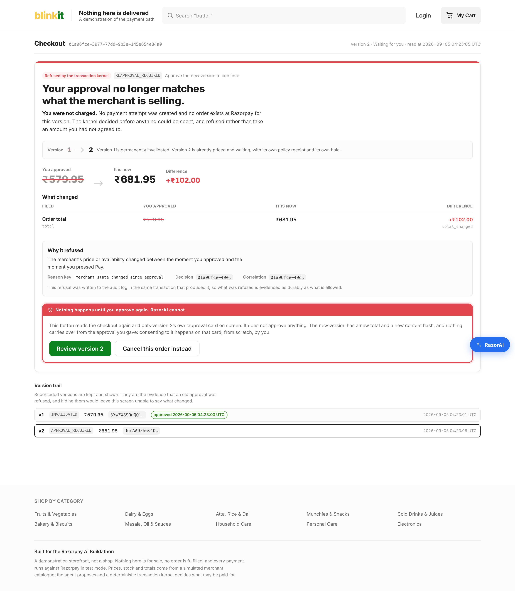
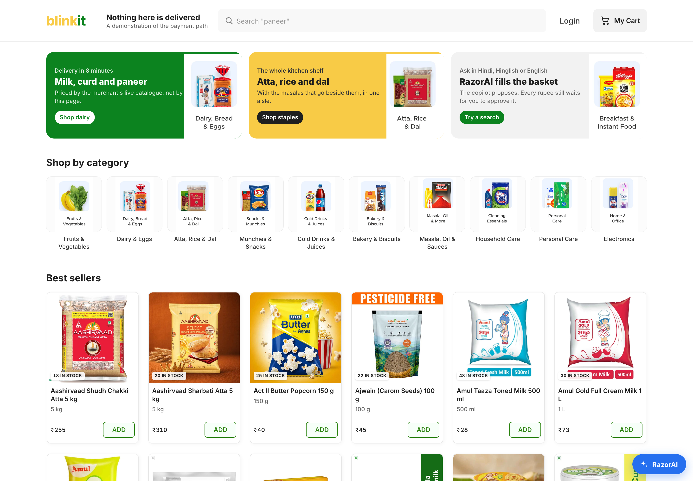
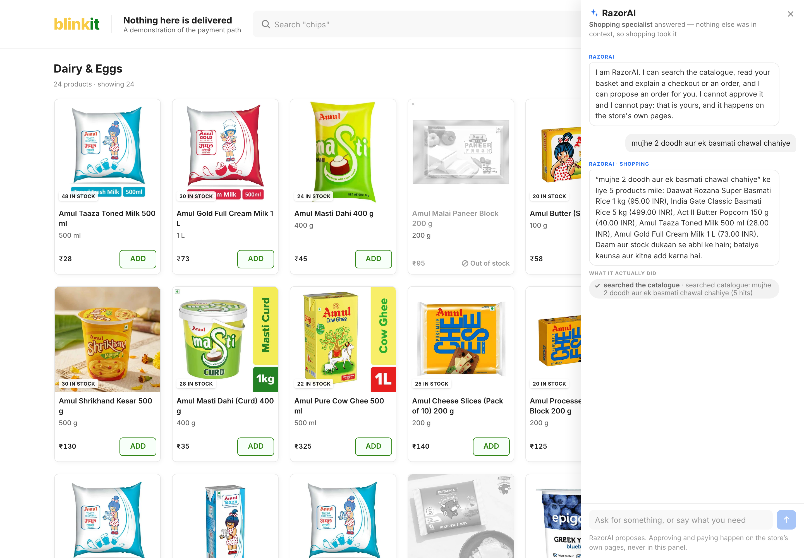
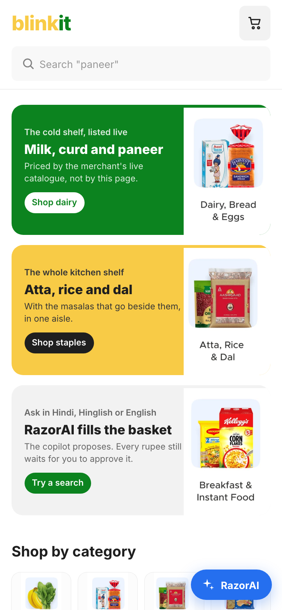
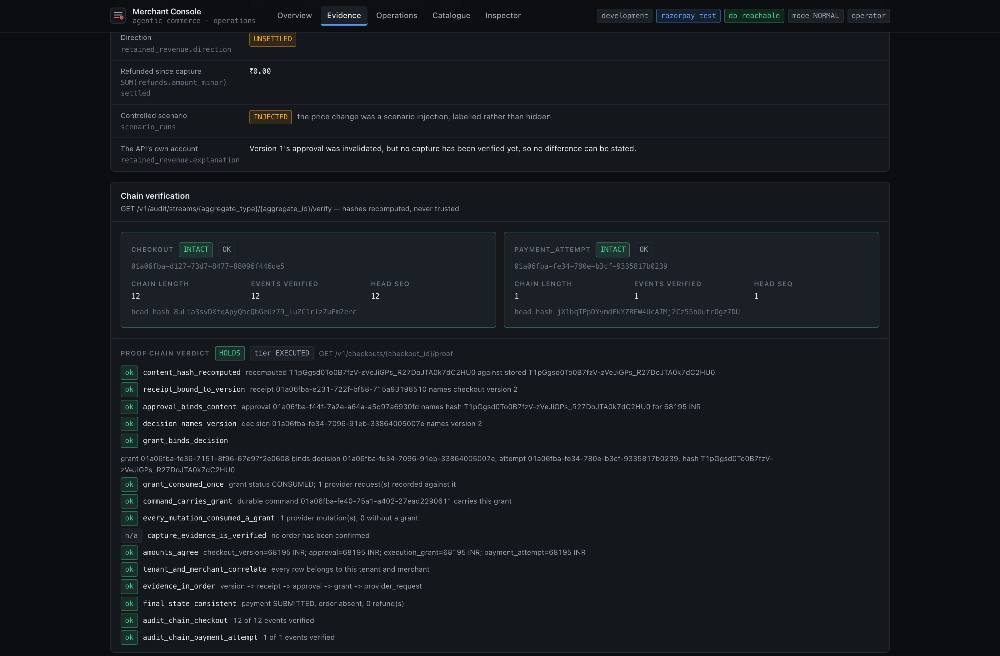

# Governed Agentic Commerce Platform

A multi-tenant agentic commerce platform that makes quick-commerce merchants safely discoverable and transactable by AI buyers while strictly preventing unauthorized payments. The entire architecture exists to enforce one non-negotiable invariant: **agents propose; deterministic systems authorize and execute.**

[](#evidence-driven-state-of-play)
[](#architecture)
[](#architecture)
[](LICENSE)

---

## 1. Visual Proof: The Single Most Persuasive Screen

Most conversational commerce demonstrations stop when the LLM claims the order is ready. The hard part is what happens underneath: **what happens when merchant prices surge or inventory drops between an agent's proposal and payment execution?**

### Price Shift Refusal Hero Moment (Steps 5, 6, 7)
When pricing moves while checkout is in flight, our **13,593-line Transaction Assurance Kernel** refuses to debit the buyer's card against stale facts. It permanently invalidates Version 1, renders an itemized material delta diff, and requires explicit human re-approval for Version 2:

<p align="center">
  
</p>

The screen states the part that matters first — **you were not charged** — and then says why: no payment attempt was created, version 1 is permanently invalidated, and version 2 is already priced and holding its own stock with its own policy receipt. The refusal was written to the audit log in the same transaction that produced it.

### Storefront & Conversational Agent Surface
The buyer storefront is a full quick-commerce clone with 247 grounded products across 10 categories and self-hosted assets, beside a dockable copilot that searches the catalogue and proposes — and says, in its own footer, that approving and paying happen on the store's pages and never in the panel:

<p align="center">
  
  &nbsp;
  
</p>

<p align="center">
  <em>Mobile: captured at a 390&nbsp;CSS-pixel viewport. The document measured 390&nbsp;px wide at capture — no horizontal scroll — and the figure is recorded in <code>docs/images/capture-manifest.json</code> rather than asserted here.</em><br/>
  
</p>

### The Evidence, Recomputed Rather Than Asserted
Every claim above is checkable from the merchant console, which recomputes the hashes instead of trusting them. The proof chain names each assertion separately, and reports the one it cannot make as `n/a` rather than green:

<p align="center">
  
</p>

---

## 2. The Eleven-Step Core Demonstration

The Track 1 core demonstration follows this sequence from natural language discovery to cryptographic settlement:

1. **Multilingual Grounded Discovery** — Buyer searches in English, Devanagari (`दूध`, `आटा`), or Hinglish; catalogue returns real grounded products with integer paise pricing.
2. **Useful Basket Growth** — Items added to basket within merchant policy and delivery thresholds.
3. **Checkout Construction** — Server-evaluated quote computes items subtotal, delivery partner fee, and GST.
4. **Trusted Approval** — Buyer signs server-confirmed JCS SHA-256 content hash and integer total on the isolated buyer surface.
5. **Merchant State Changes Underneath Approved Checkout** — *(The step conversational demos skip)* Merchant raises unit prices or delivery fees while checkout is in progress.
6. **Old Approval Rejected** — *(The step conversational demos skip)* Transaction Assurance Kernel detects stale facts and strictly denies execution (`STALE_APPROVAL_REFUSED`).
7. **Exact Delta Shown; Version N+1 Created** — *(The step conversational demos skip)* Exact field-level differences (`PRICE_CHANGED`, `DELIVERY_CHANGED`) are displayed; Version 1 is killed.
8. **Fresh Approval on Version N+1** — *(The step conversational demos skip)* Buyer inspects deltas and authorizes Version 2.
9. **Razorpay Test-Mode Payment** — Kernel confirms state match under row locks, consumes approval once, and mints an **Execution Grant** for Razorpay Standard Checkout.
10. **Money Action Proof Chain** — Browser callback is treated as unverified intent; final settlement requires cryptographic webhook verification.
11. **Merchant Retained-Revenue Evidence** — PostgreSQL audit log records preserved revenue from prevented drift, verifiable in the Merchant Console.

---

## 3. Architecture

The system enforces strict dual-loop isolation. **The money path is emerald; the agent's reach is rose.** The agent can never cross the deterministic boundary:

<p align="center">
  
</p>

### Key Architectural Invariants
- **Integer Minor Units Only**: Money is always stored and calculated in integer paise (`₹28.00` = `2800`). Floats are strictly prohibited and rejected at canonicalization.
- **Single-Winner Concurrency**: Handled via PostgreSQL 16 row-level pessimistic locks (`FOR NO KEY UPDATE`) preventing duplicate Execution Grants under contending parallel sessions.
- **Deterministic Hashing**: Orders are hashed using RFC 8785 JSON Canonicalization Scheme (JCS).
- **Zero Headless Debits**: Payments execute exclusively on the trusted buyer surface via Razorpay Standard Checkout; AI agents cannot trigger automated headless charges.

---

## 4. How to Run It

A comprehensive, runnable guide with both zero-dependency **Mock Mode** (browser-only) and **Live Mode** (PostgreSQL 16 + Commerce API) is documented in:

👉 **[docs/DEMO.md](docs/DEMO.md)**

### Quick Verification Commands
```bash
# Run complete 11-step end-to-end journey in Playwright (Desktop + 390px Mobile):
cd apps/buyer-web && npm run e2e

# Run buyer-web unit tests (582 tests, 35 files):
cd apps/buyer-web && npm test

# Run merchant simulator tests (180 tests):
uv run python -m pytest packages/merchant-sim -q
```

---

## 5. Evidence-Driven State of Play

Per specification section 35, no component is claimed as working without automated test evidence in this repository. See **[docs/STATUS.md](docs/STATUS.md)** for exhaustive details.

| Component | Status | Verified By |
| :--- | :--- | :--- |
| **Transaction Assurance Kernel** | **Verified** | 13,608 lines; `test_grants.py`, `test_admission.py`, proven under real contending database sessions |
| **Single-Winner Admission** | **Verified** | `test_admission.py`, 17 cases including a multi-thread race proving exactly one winner |
| **The refusal, end to end** | **Verified** | Approve a version, move merchant state underneath it, submit: HTTP 200 `allowed:false`, `REAPPROVAL_REQUIRED`, version 1 `INVALIDATED`, version 2 required. Proven by `test_capi_journey.py::test_submitting_version_one_after_supersede_is_refused` and four sibling tests; the list is in `docs/STATUS.md` |
| **RFC 8785 JCS Canonicalization** | **Verified** | `test_jcs.py`, strict integer-only profile with float rejection |
| **Tenant Isolation (RLS)** | **Verified** | `test_tenant_isolation.py`, roles asserted `NOSUPERUSER NOBYPASSRLS` before any test runs |
| **Razorpay, test mode, for real** | **Verified live** | The durable worker created two real orders (ids truncated here as `order_TYBD…`, since they name a live test-mode account) against `api.razorpay.com`, each under a single-use grant consumed before the network call |
| **Commerce API** | **Verified** | 62 OpenAPI paths carrying 64 operations; RFC 9457 problems; a kernel denial is HTTP 200 carrying a decision, never a 4xx |
| **Storefront, 247 products** | **Verified** | `apps/buyer-web`, Next.js 16, 319 local WebP images, zero external image origins, and no fixture path of any kind |
| **RazorAI, the buyer copilot** | **Verified** | Five specialists under two Python harnesses; live Hinglish turns with deterministic routing and a real tool log; principal `session:…/razorai/shopping` |
| **Merchant Console** | **Verified** | `apps/merchant-console`, operator session minted server-side; every figure read from the API in that page load |
| **Backend suite** | **Verified** | 5,597 tests passing, 8 skipped, 11 expected failures that name known defects; mypy strict across 245 source files. Per-package figures and the command behind each are in `docs/STATUS.md` |
| **Frontend test suites** | **Verified** | `buyer-web` 582 unit tests in 35 files; `merchant-console` 129 in 12. Both typecheck and lint clean, and both produce a production build |
| **Realtime Voice STT/TTS** | **Verified** | `packages/voice-runtime`, 407 tests passing. Split pipeline per specification 19.1: text exists before speech, so a money sentence can be refused before it is spoken. The 8 skips are the real-audio tests, which need `GOOGLE_CLOUD_PROJECT` |
| **Protocol layer (UCP, AP2, ACP, MCP)** | **Verified** | `packages/commerce-protocols`, 367 tests across specification sections 13 to 17. ACP and MCP are complete libraries and are not yet mounted over HTTP — `docs/KNOWN_GAPS.md` |
| *Autonomous Reserve Pay* | *Simulator verified; autonomous rail planned* | Specification section 12. The section 12.3 labelled simulator is built and tested in `apps/buyer-web/src/features/reserve-pay`, behind an undismissable banner stating that no mandate exists, no authority was granted, and no money can move. Only the human-absent rail is held in Safe Mode |

---

## Disclaimers & Independent Project Proposal

An independent project proposal for the **Razorpay AI Buildathon (Track 1)**. Not an official Razorpay, Zepto, Google, OpenAI, or NPCI product. Quick-commerce catalog imagery and names are used strictly for local evaluation and interface realism. Merchant console figures are read from the API on each page load; neither application ships a fixture, and an unreachable API renders an error rather than invented data.\n