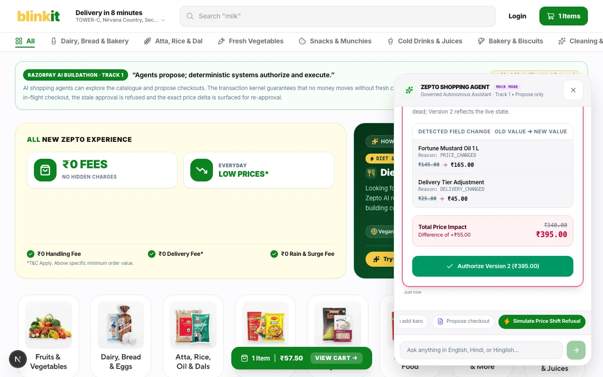
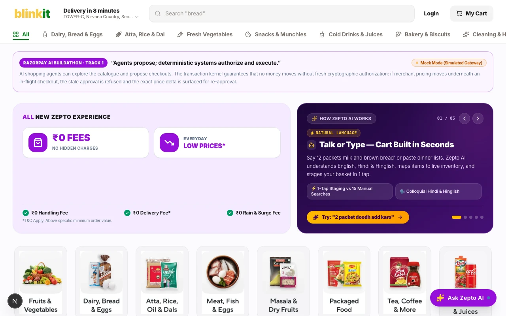
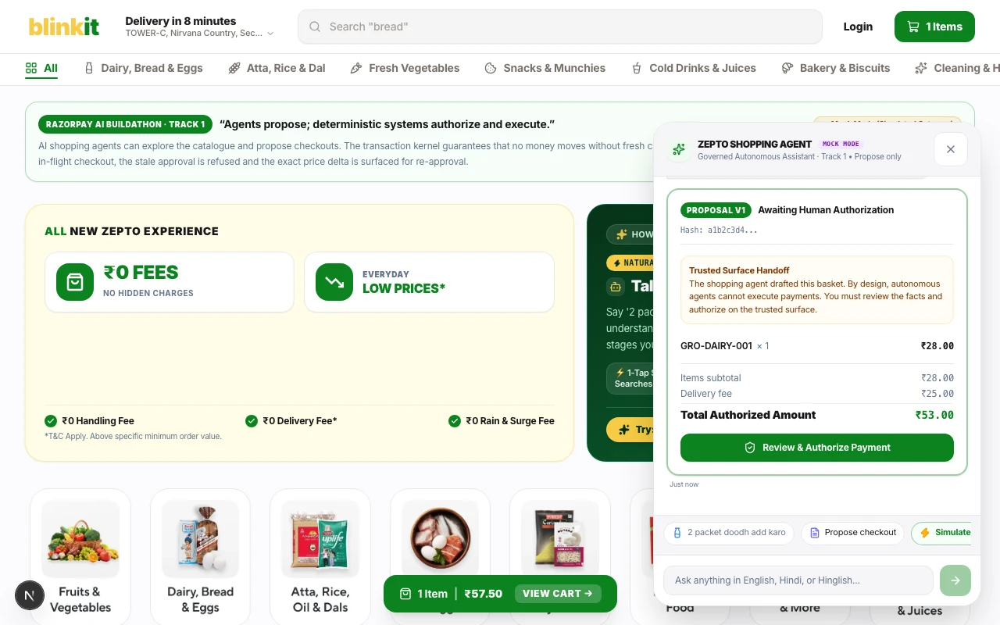
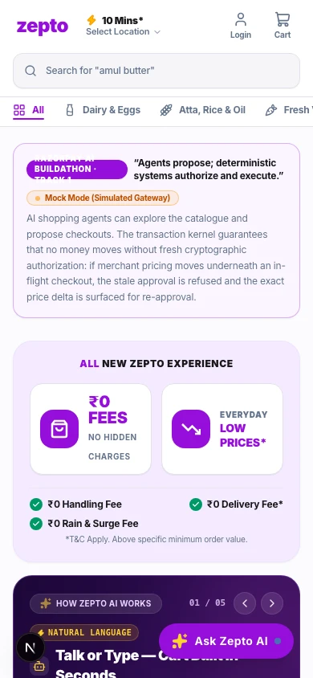

# Governed Agentic Commerce Platform

A multi-tenant agentic commerce platform that makes quick-commerce merchants safely discoverable and transactable by AI buyers while strictly preventing unauthorized payments. The entire architecture exists to enforce one non-negotiable invariant: **agents propose; deterministic systems authorize and execute.**

[](#evidence-driven-state-of-play)
[](#architecture)
[](#architecture)
[](LICENSE)

---

## 1. Visual Proof: The Single Most Persuasive Screen

Most conversational commerce demonstrations stop when the LLM claims the order is ready. The hard part is what happens underneath: **what happens when merchant prices surge or inventory drops between an agent's proposal and payment execution?**

### Price Shift Refusal Hero Moment (Steps 5, 6, 7)
When pricing moves while checkout is in flight, our **13,593-line Transaction Assurance Kernel** refuses to debit the buyer's card against stale facts. It permanently invalidates Version 1, renders an itemized material delta diff, and requires explicit human re-approval for Version 2:

<p align="center">
  
</p>

### Storefront & Conversational Agent Surface
The buyer storefront is a full quick-commerce clone with 247 grounded products across 10 categories, self-hosted assets, and a dockable conversational agent panel with real-time tool execution chips:

<p align="center">
  
  &nbsp;
  
</p>

<p align="center">
  <em>Mobile Experience: Hardened down to 390px viewports with bottom-sheet assistant drawer, 44px tap targets, and zero horizontal scroll.</em><br/>
  
</p>

---

## 2. The Eleven-Step Core Demonstration

The Track 1 core demonstration follows this sequence from natural language discovery to cryptographic settlement:

1. **Multilingual Grounded Discovery** — Buyer searches in English, Devanagari (`दूध`, `आटा`), or Hinglish; catalogue returns real grounded products with integer paise pricing.
2. **Useful Basket Growth** — Items added to basket within merchant policy and delivery thresholds.
3. **Checkout Construction** — Server-evaluated quote computes items subtotal, delivery partner fee, and GST.
4. **Trusted Approval** — Buyer signs server-confirmed JCS SHA-256 content hash and integer total on the isolated buyer surface.
5. **Merchant State Changes Underneath Approved Checkout** — *(The step conversational demos skip)* Merchant raises unit prices or delivery fees while checkout is in progress.
6. **Old Approval Rejected** — *(The step conversational demos skip)* Transaction Assurance Kernel detects stale facts and strictly denies execution (`STALE_APPROVAL_REFUSED`).
7. **Exact Delta Shown; Version N+1 Created** — *(The step conversational demos skip)* Exact field-level differences (`PRICE_CHANGED`, `DELIVERY_CHANGED`) are displayed; Version 1 is killed.
8. **Fresh Approval on Version N+1** — *(The step conversational demos skip)* Buyer inspects deltas and authorizes Version 2.
9. **Razorpay Test-Mode Payment** — Kernel confirms state match under row locks, consumes approval once, and mints an **Execution Grant** for Razorpay Standard Checkout.
10. **Money Action Proof Chain** — Browser callback is treated as unverified intent; final settlement requires cryptographic webhook verification.
11. **Merchant Retained-Revenue Evidence** — PostgreSQL audit log records preserved revenue from prevented drift, verifiable in the Merchant Console.

---

## 3. Architecture

The system enforces strict dual-loop isolation. **The money path is emerald; the agent's reach is rose.** The agent can never cross the deterministic boundary:

<p align="center">
  
</p>

### Key Architectural Invariants
- **Integer Minor Units Only**: Money is always stored and calculated in integer paise (`₹28.00` = `2800`). Floats are strictly prohibited and rejected at canonicalization.
- **Single-Winner Concurrency**: Handled via PostgreSQL 16 row-level pessimistic locks (`FOR NO KEY UPDATE`) preventing duplicate Execution Grants under contending parallel sessions.
- **Deterministic Hashing**: Orders are hashed using RFC 8785 JSON Canonicalization Scheme (JCS).
- **Zero Headless Debits**: Payments execute exclusively on the trusted buyer surface via Razorpay Standard Checkout; AI agents cannot trigger automated headless charges.

---

## 4. How to Run It

A comprehensive, runnable guide with both zero-dependency **Mock Mode** (browser-only) and **Live Mode** (PostgreSQL 16 + Commerce API) is documented in:

👉 **[docs/DEMO.md](docs/DEMO.md)**

### Quick Verification Commands
```bash
# Run complete 11-step end-to-end journey in Playwright (Desktop + 390px Mobile):
cd apps/buyer-web && npm run e2e

# Run buyer-web unit tests (220 tests, 14 files):
cd apps/buyer-web && npm test

# Run merchant simulator tests (175 tests):
uv run python -m pytest packages/merchant-sim -q
```

---

## 5. Evidence-Driven State of Play

Per specification section 35, no component is claimed as working without automated test evidence in this repository. See **[docs/STATUS.md](docs/STATUS.md)** for exhaustive details.

| Component | Status | Verified By |
| :--- | :--- | :--- |
| **Transaction Assurance Kernel** | **Verified** | 13,593 lines; `test_grants.py`, `test_admission.py`, proven under real contending database sessions |
| **Single-Winner Admission** | **Verified** | `test_admission.py`, 17 cases including a multi-thread race proving exactly one winner |
| **The refusal, end to end** | **Verified** | Approve a version, move merchant state underneath it, submit: HTTP 200 `allowed:false`, `REAPPROVAL_REQUIRED`, version 1 `INVALIDATED`, version 2 required. Proven by `test_capi_journey.py::test_submitting_version_one_after_supersede_is_refused` and four sibling tests; the list is in `docs/STATUS.md` |
| **RFC 8785 JCS Canonicalization** | **Verified** | `test_jcs.py`, strict integer-only profile with float rejection |
| **Tenant Isolation (RLS)** | **Verified** | `test_tenant_isolation.py`, roles asserted `NOSUPERUSER NOBYPASSRLS` before any test runs |
| **Razorpay, test mode, for real** | **Verified live** | The durable worker created `order_TYBD5rc3noKwlL` and `order_TYBDXtQ03GfFkG` against `api.razorpay.com`, each under a single-use grant consumed before the network call |
| **Commerce API** | **Verified** | 50 OpenAPI paths carrying 51 operations; RFC 9457 problems; a kernel denial is HTTP 200 carrying a decision, never a 4xx |
| **Storefront, 247 products** | **Verified** | `apps/buyer-web`, Next.js 16, 319 local WebP images, zero external image origins, and no fixture path of any kind |
| **RazorAI, the buyer copilot** | **Verified** | Five specialists under two Python harnesses; live Hinglish turns with deterministic routing and a real tool log; principal `session:…/razorai/shopping` |
| **Merchant Console** | **Verified** | `apps/merchant-console`, operator session minted server-side; every figure read from the API in that page load |
| **Backend suite** | **Verified** | 4,595 tests passing, 6 skipped; mypy strict across 231 source files. Per-package figures and the command behind each are in `docs/STATUS.md` |
| **Frontend test suites** | **Verified** | `buyer-web` 220 unit tests in 14 files; `merchant-console` 91 in 8. Both typecheck and lint clean |
| **Realtime Voice STT/TTS** | **Verified** | `packages/voice-runtime`, 233 tests passing. Split pipeline per specification 19.1: text exists before speech, so a money sentence can be refused before it is spoken. The 6 skips are the real-audio tests, which need `GOOGLE_CLOUD_PROJECT` |
| **Protocol layer (UCP, AP2, ACP, MCP)** | **Verified** | `packages/commerce-protocols`, 367 tests across specification sections 13 to 17. ACP and MCP are complete libraries and are not yet mounted over HTTP — `docs/KNOWN_GAPS.md` |
| *Autonomous Reserve Pay* | *Planned* | Specification section 14; intentionally held in Safe Mode |

---

## Disclaimers & Independent Project Proposal

An independent project proposal for the **Razorpay AI Buildathon (Track 1)**. Not an official Razorpay, Zepto, Google, OpenAI, or NPCI product. Quick-commerce catalog imagery and names are used strictly for local evaluation and interface realism. Merchant console figures are read from the API on each page load; neither application ships a fixture, and an unreachable API renders an error rather than invented data.\n